# Introduction
Data processing library for python. 

`pip install pandas`


```python
import pandas as pd #importing pandas 
```

# Series and Dataframe 
## Dataframe
A dynamic 2D array (matrix / tables) 


```python
ds = pd.read_csv('pandas_ds/data/olympics.csv') #rading the CSV file into 'ds' object 
```


```python
ds.head()
```


<div>
<style scoped>
    .dataframe tbody tr th:only-of-type {
        vertical-align: middle;
    }

    .dataframe tbody tr th {
        vertical-align: top;
    }

    .dataframe thead th {
        text-align: right;
    }
</style>
<table border="1" class="dataframe">
  <thead>
    <tr style="text-align: right;">
      <th></th>
      <th>List of medallists at the Games of the Olympiad per edition, sport, discipline, gender and event</th>
      <th>Unnamed: 1</th>
      <th>Unnamed: 2</th>
      <th>Unnamed: 3</th>
      <th>Unnamed: 4</th>
      <th>Unnamed: 5</th>
      <th>Unnamed: 6</th>
      <th>Unnamed: 7</th>
      <th>Unnamed: 8</th>
      <th>Unnamed: 9</th>
    </tr>
  </thead>
  <tbody>
    <tr>
      <th>0</th>
      <td>NaN</td>
      <td>NaN</td>
      <td>NaN</td>
      <td>NaN</td>
      <td>NaN</td>
      <td>NaN</td>
      <td>NaN</td>
      <td>NaN</td>
      <td>NaN</td>
      <td>NaN</td>
    </tr>
    <tr>
      <th>1</th>
      <td>DISCLAIMER: The IOC Research and Reference Ser...</td>
      <td>NaN</td>
      <td>NaN</td>
      <td>NaN</td>
      <td>NaN</td>
      <td>NaN</td>
      <td>NaN</td>
      <td>NaN</td>
      <td>NaN</td>
      <td>NaN</td>
    </tr>
    <tr>
      <th>2</th>
      <td>NaN</td>
      <td>NaN</td>
      <td>NaN</td>
      <td>NaN</td>
      <td>NaN</td>
      <td>NaN</td>
      <td>NaN</td>
      <td>NaN</td>
      <td>NaN</td>
      <td>NaN</td>
    </tr>
    <tr>
      <th>3</th>
      <td>City</td>
      <td>Edition</td>
      <td>Sport</td>
      <td>Discipline</td>
      <td>Athlete</td>
      <td>NOC</td>
      <td>Gender</td>
      <td>Event</td>
      <td>Event_gender</td>
      <td>Medal</td>
    </tr>
    <tr>
      <th>4</th>
      <td>Athens</td>
      <td>1896</td>
      <td>Aquatics</td>
      <td>Swimming</td>
      <td>HAJOS, Alfred</td>
      <td>HUN</td>
      <td>Men</td>
      <td>100m freestyle</td>
      <td>M</td>
      <td>Gold</td>
    </tr>
  </tbody>
</table>
</div>


```python
ds = pd.read_csv('pandas_ds/data/olympics.csv', skiprows=4) #skip first 4 rows 
ds.head()
```


<div>
<style scoped>
    .dataframe tbody tr th:only-of-type {
        vertical-align: middle;
    }

    .dataframe tbody tr th {
        vertical-align: top;
    }

    .dataframe thead th {
        text-align: right;
    }
</style>
<table border="1" class="dataframe">
  <thead>
    <tr style="text-align: right;">
      <th></th>
      <th>City</th>
      <th>Edition</th>
      <th>Sport</th>
      <th>Discipline</th>
      <th>Athlete</th>
      <th>NOC</th>
      <th>Gender</th>
      <th>Event</th>
      <th>Event_gender</th>
      <th>Medal</th>
    </tr>
  </thead>
  <tbody>
    <tr>
      <th>0</th>
      <td>Athens</td>
      <td>1896</td>
      <td>Aquatics</td>
      <td>Swimming</td>
      <td>HAJOS, Alfred</td>
      <td>HUN</td>
      <td>Men</td>
      <td>100m freestyle</td>
      <td>M</td>
      <td>Gold</td>
    </tr>
    <tr>
      <th>1</th>
      <td>Athens</td>
      <td>1896</td>
      <td>Aquatics</td>
      <td>Swimming</td>
      <td>HERSCHMANN, Otto</td>
      <td>AUT</td>
      <td>Men</td>
      <td>100m freestyle</td>
      <td>M</td>
      <td>Silver</td>
    </tr>
    <tr>
      <th>2</th>
      <td>Athens</td>
      <td>1896</td>
      <td>Aquatics</td>
      <td>Swimming</td>
      <td>DRIVAS, Dimitrios</td>
      <td>GRE</td>
      <td>Men</td>
      <td>100m freestyle for sailors</td>
      <td>M</td>
      <td>Bronze</td>
    </tr>
    <tr>
      <th>3</th>
      <td>Athens</td>
      <td>1896</td>
      <td>Aquatics</td>
      <td>Swimming</td>
      <td>MALOKINIS, Ioannis</td>
      <td>GRE</td>
      <td>Men</td>
      <td>100m freestyle for sailors</td>
      <td>M</td>
      <td>Gold</td>
    </tr>
    <tr>
      <th>4</th>
      <td>Athens</td>
      <td>1896</td>
      <td>Aquatics</td>
      <td>Swimming</td>
      <td>CHASAPIS, Spiridon</td>
      <td>GRE</td>
      <td>Men</td>
      <td>100m freestyle for sailors</td>
      <td>M</td>
      <td>Silver</td>
    </tr>
  </tbody>
</table>
</div>


## Series 
* 1D array of indexed data, dataframe is an ordered list of serieses.  
* pandas supports alphanumeric indexing
* first column is called index 
* Accessing a column(s)
    1. `df['col']`
    2. `df["col"]`
    3. `df.col` _doesn't work if col name has a space in it_
    4. `df[ ['col1','col2'] ]` _accessing multiple columns_
* to see object type use `type()` function


```python
# accessing a series (column)
print(ds['City'].head(5),'\n') # way1
print(ds["City"].head(5),'\n') # way2
print(ds.City.head(5),'\n')    # way3
print(ds[ ['City','Edition'] ].head(5))    # way3
```

    0    Athens
    1    Athens
    2    Athens
    3    Athens
    4    Athens
    Name: City, dtype: object 
    
    0    Athens
    1    Athens
    2    Athens
    3    Athens
    4    Athens
    Name: City, dtype: object 
    
    0    Athens
    1    Athens
    2    Athens
    3    Athens
    4    Athens
    Name: City, dtype: object 
    
         City  Edition
    0  Athens     1896
    1  Athens     1896
    2  Athens     1896
    3  Athens     1896
    4  Athens     1896
    

### Confirming data type of pandas object 


```python
type(ds.City)
```


    pandas.core.series.Series


```python
type(ds[ ['City', 'Edition'] ])
```


    pandas.core.frame.DataFrame


```python
type(ds)
```


    pandas.core.frame.DataFrame


## Problem Excersise
1. list olympic dataframe 
2. list only noc coloumn using both '.' and '[]' notation, what type is the object ?
3. list edition, city , athlete name and madel column, what type is this object ? 


```python
# task 1
print('---------------task 1--------------------\n')
print(ds.head(5))

#task 2
print('---------------task 2--------------------\n')
print(ds.NOC.head(5),'\n')
print(ds['NOC'].head(5),'\n')
print(type(ds.NOC))

#task3
print('---------------task 3--------------------\n')
print(ds[ ['Edition', 'City', 'Athlete' , 'Medal']].head(5),'\n' )
print(type(ds[ ['Edition', 'City', 'Athlete' , 'Medal']].head(5)))
```

    ---------------task 1--------------------
    
         City  Edition     Sport Discipline             Athlete  NOC Gender  \
    0  Athens     1896  Aquatics   Swimming       HAJOS, Alfred  HUN    Men   
    1  Athens     1896  Aquatics   Swimming    HERSCHMANN, Otto  AUT    Men   
    2  Athens     1896  Aquatics   Swimming   DRIVAS, Dimitrios  GRE    Men   
    3  Athens     1896  Aquatics   Swimming  MALOKINIS, Ioannis  GRE    Men   
    4  Athens     1896  Aquatics   Swimming  CHASAPIS, Spiridon  GRE    Men   
    
                            Event Event_gender   Medal  
    0              100m freestyle            M    Gold  
    1              100m freestyle            M  Silver  
    2  100m freestyle for sailors            M  Bronze  
    3  100m freestyle for sailors            M    Gold  
    4  100m freestyle for sailors            M  Silver  
    ---------------task 2--------------------
    
    0    HUN
    1    AUT
    2    GRE
    3    GRE
    4    GRE
    Name: NOC, dtype: object 
    
    0    HUN
    1    AUT
    2    GRE
    3    GRE
    4    GRE
    Name: NOC, dtype: object 
    
    <class 'pandas.core.series.Series'>
    ---------------task 3--------------------
    
       Edition    City             Athlete   Medal
    0     1896  Athens       HAJOS, Alfred    Gold
    1     1896  Athens    HERSCHMANN, Otto  Silver
    2     1896  Athens   DRIVAS, Dimitrios  Bronze
    3     1896  Athens  MALOKINIS, Ioannis    Gold
    4     1896  Athens  CHASAPIS, Spiridon  Silver 
    
    <class 'pandas.core.frame.DataFrame'>
    

# Data Input and Validation

## `read_csv()` function 
reads a CSV file into a dataframe


```python
list(range(0,4))
```


    [0, 1, 2, 3]


```python
pd.read_csv('pandas_ds/data/olympics.csv', skiprows=list(range(0,4))).head()
```


<div>
<style scoped>
    .dataframe tbody tr th:only-of-type {
        vertical-align: middle;
    }

    .dataframe tbody tr th {
        vertical-align: top;
    }

    .dataframe thead th {
        text-align: right;
    }
</style>
<table border="1" class="dataframe">
  <thead>
    <tr style="text-align: right;">
      <th></th>
      <th>City</th>
      <th>Edition</th>
      <th>Sport</th>
      <th>Discipline</th>
      <th>Athlete</th>
      <th>NOC</th>
      <th>Gender</th>
      <th>Event</th>
      <th>Event_gender</th>
      <th>Medal</th>
    </tr>
  </thead>
  <tbody>
    <tr>
      <th>0</th>
      <td>Athens</td>
      <td>1896</td>
      <td>Aquatics</td>
      <td>Swimming</td>
      <td>HAJOS, Alfred</td>
      <td>HUN</td>
      <td>Men</td>
      <td>100m freestyle</td>
      <td>M</td>
      <td>Gold</td>
    </tr>
    <tr>
      <th>1</th>
      <td>Athens</td>
      <td>1896</td>
      <td>Aquatics</td>
      <td>Swimming</td>
      <td>HERSCHMANN, Otto</td>
      <td>AUT</td>
      <td>Men</td>
      <td>100m freestyle</td>
      <td>M</td>
      <td>Silver</td>
    </tr>
    <tr>
      <th>2</th>
      <td>Athens</td>
      <td>1896</td>
      <td>Aquatics</td>
      <td>Swimming</td>
      <td>DRIVAS, Dimitrios</td>
      <td>GRE</td>
      <td>Men</td>
      <td>100m freestyle for sailors</td>
      <td>M</td>
      <td>Bronze</td>
    </tr>
    <tr>
      <th>3</th>
      <td>Athens</td>
      <td>1896</td>
      <td>Aquatics</td>
      <td>Swimming</td>
      <td>MALOKINIS, Ioannis</td>
      <td>GRE</td>
      <td>Men</td>
      <td>100m freestyle for sailors</td>
      <td>M</td>
      <td>Gold</td>
    </tr>
    <tr>
      <th>4</th>
      <td>Athens</td>
      <td>1896</td>
      <td>Aquatics</td>
      <td>Swimming</td>
      <td>CHASAPIS, Spiridon</td>
      <td>GRE</td>
      <td>Men</td>
      <td>100m freestyle for sailors</td>
      <td>M</td>
      <td>Silver</td>
    </tr>
  </tbody>
</table>
</div>


## `shape` attribute


```python
ds.shape    #returns the dimention in a touple of tha dataframe (row,col) 
```


    (29216, 10)


```python
print(f'rows = {ds.shape[0]} , cols = {ds.shape[1]} ')
```

    rows = 29216 , cols = 10 
    

## `head()` & `Teil()`
* by default first five (head) and last five (tail) rows
* number can be manipulated by putting parameters 
* use negative parameter e.g. `ds.head(-n)` or `ds.tail(-n)` to print all rows but __last n or first n__ respectively


```python
ds.head(4)
```


<div>
<style scoped>
    .dataframe tbody tr th:only-of-type {
        vertical-align: middle;
    }

    .dataframe tbody tr th {
        vertical-align: top;
    }

    .dataframe thead th {
        text-align: right;
    }
</style>
<table border="1" class="dataframe">
  <thead>
    <tr style="text-align: right;">
      <th></th>
      <th>City</th>
      <th>Edition</th>
      <th>Sport</th>
      <th>Discipline</th>
      <th>Athlete</th>
      <th>NOC</th>
      <th>Gender</th>
      <th>Event</th>
      <th>Event_gender</th>
      <th>Medal</th>
    </tr>
  </thead>
  <tbody>
    <tr>
      <th>0</th>
      <td>Athens</td>
      <td>1896</td>
      <td>Aquatics</td>
      <td>Swimming</td>
      <td>HAJOS, Alfred</td>
      <td>HUN</td>
      <td>Men</td>
      <td>100m freestyle</td>
      <td>M</td>
      <td>Gold</td>
    </tr>
    <tr>
      <th>1</th>
      <td>Athens</td>
      <td>1896</td>
      <td>Aquatics</td>
      <td>Swimming</td>
      <td>HERSCHMANN, Otto</td>
      <td>AUT</td>
      <td>Men</td>
      <td>100m freestyle</td>
      <td>M</td>
      <td>Silver</td>
    </tr>
    <tr>
      <th>2</th>
      <td>Athens</td>
      <td>1896</td>
      <td>Aquatics</td>
      <td>Swimming</td>
      <td>DRIVAS, Dimitrios</td>
      <td>GRE</td>
      <td>Men</td>
      <td>100m freestyle for sailors</td>
      <td>M</td>
      <td>Bronze</td>
    </tr>
    <tr>
      <th>3</th>
      <td>Athens</td>
      <td>1896</td>
      <td>Aquatics</td>
      <td>Swimming</td>
      <td>MALOKINIS, Ioannis</td>
      <td>GRE</td>
      <td>Men</td>
      <td>100m freestyle for sailors</td>
      <td>M</td>
      <td>Gold</td>
    </tr>
  </tbody>
</table>
</div>


```python
ds.tail(4)
```


<div>
<style scoped>
    .dataframe tbody tr th:only-of-type {
        vertical-align: middle;
    }

    .dataframe tbody tr th {
        vertical-align: top;
    }

    .dataframe thead th {
        text-align: right;
    }
</style>
<table border="1" class="dataframe">
  <thead>
    <tr style="text-align: right;">
      <th></th>
      <th>City</th>
      <th>Edition</th>
      <th>Sport</th>
      <th>Discipline</th>
      <th>Athlete</th>
      <th>NOC</th>
      <th>Gender</th>
      <th>Event</th>
      <th>Event_gender</th>
      <th>Medal</th>
    </tr>
  </thead>
  <tbody>
    <tr>
      <th>29212</th>
      <td>Beijing</td>
      <td>2008</td>
      <td>Wrestling</td>
      <td>Wrestling Gre-R</td>
      <td>MIZGAITIS, Mindaugas</td>
      <td>LTU</td>
      <td>Men</td>
      <td>96 - 120kg</td>
      <td>M</td>
      <td>Bronze</td>
    </tr>
    <tr>
      <th>29213</th>
      <td>Beijing</td>
      <td>2008</td>
      <td>Wrestling</td>
      <td>Wrestling Gre-R</td>
      <td>PATRIKEEV, Yuri</td>
      <td>ARM</td>
      <td>Men</td>
      <td>96 - 120kg</td>
      <td>M</td>
      <td>Bronze</td>
    </tr>
    <tr>
      <th>29214</th>
      <td>Beijing</td>
      <td>2008</td>
      <td>Wrestling</td>
      <td>Wrestling Gre-R</td>
      <td>LOPEZ, Mijain</td>
      <td>CUB</td>
      <td>Men</td>
      <td>96 - 120kg</td>
      <td>M</td>
      <td>Gold</td>
    </tr>
    <tr>
      <th>29215</th>
      <td>Beijing</td>
      <td>2008</td>
      <td>Wrestling</td>
      <td>Wrestling Gre-R</td>
      <td>BAROEV, Khasan</td>
      <td>RUS</td>
      <td>Men</td>
      <td>96 - 120kg</td>
      <td>M</td>
      <td>Silver</td>
    </tr>
  </tbody>
</table>
</div>


## info
* printing summary 
* useful to see which column has any missing data,
* compare number of non-nulls with total number of entries 


```python
ds.info()
```

    <class 'pandas.core.frame.DataFrame'>
    RangeIndex: 29216 entries, 0 to 29215
    Data columns (total 10 columns):
    City            29216 non-null object
    Edition         29216 non-null int64
    Sport           29216 non-null object
    Discipline      29216 non-null object
    Athlete         29216 non-null object
    NOC             29216 non-null object
    Gender          29216 non-null object
    Event           29216 non-null object
    Event_gender    29216 non-null object
    Medal           29216 non-null object
    dtypes: int64(1), object(9)
    memory usage: 2.2+ MB
    

# Basic Data analysis 

## `value_counts()`
* takes a series and returns a series object, counting all the unique values 
* The returned sereis is ordered by frequency 
* flags
    - `ascending` : alter freq order  (false by def)
    - `dropna`    : doesn't count N/A (true by def)
    - `sort`      : sort by freq (true by def)


```python
ds['City'].value_counts()
```


    Athens                   2149
    Los Angeles              2074
    Beijing                  2042
    Sydney                   2015
    Atlanta                  1859
    Barcelona                1705
    London                   1618
    Seoul                    1546
    Paris                    1396
    Moscow                   1387
    Montreal                 1305
    Antwerp                  1298
    Munich                   1185
    Mexico                   1031
    Tokyo                    1010
    Helsinki                  889
    Melbourne / Stockholm     885
    Stockholm                 885
    Rome                      882
    Berlin                    875
    Amsterdam                 710
    St Louis                  470
    Name: City, dtype: int64


```python
# top 10 years when most madels were given
ds.Edition.value_counts().head(10)
```


    2008    2042
    2000    2015
    2004    1998
    1996    1859
    1992    1705
    1988    1546
    1984    1459
    1980    1387
    1976    1305
    1920    1298
    Name: Edition, dtype: int64


```python
# how many madels were given to men and women throuout the history 
ds.Gender.value_counts()
```


    Men      21721
    Women     7495
    Name: Gender, dtype: int64


## `sort_values()`
* sort type : quick (def), merge, heap


```python
# sort the series by the atheletes' name
ds['Athlete'].sort_values().head(5)
```


    651                 AABYE, Edgar
    2849       AALTONEN, Arvo Ossian
    2852       AALTONEN, Arvo Ossian
    7716    AALTONEN, Paavo Johannes
    7730    AALTONEN, Paavo Johannes
    Name: Athlete, dtype: object


```python
# sort the edition first, for each value of edition sort by athlete name 
ds[ ['Edition','Athlete'] ].sort_values(by=['Edition', 'Athlete']).head(10)
```


<div>
<style scoped>
    .dataframe tbody tr th:only-of-type {
        vertical-align: middle;
    }

    .dataframe tbody tr th {
        vertical-align: top;
    }

    .dataframe thead th {
        text-align: right;
    }
</style>
<table border="1" class="dataframe">
  <thead>
    <tr style="text-align: right;">
      <th></th>
      <th>Edition</th>
      <th>Athlete</th>
    </tr>
  </thead>
  <tbody>
    <tr>
      <th>7</th>
      <td>1896</td>
      <td>ANDREOU, Joannis</td>
    </tr>
    <tr>
      <th>82</th>
      <td>1896</td>
      <td>ANDRIAKOPOULOS, Nicolaos</td>
    </tr>
    <tr>
      <th>110</th>
      <td>1896</td>
      <td>ANDRIAKOPOULOS, Nicolaos</td>
    </tr>
    <tr>
      <th>111</th>
      <td>1896</td>
      <td>ATHANASOPOULOS, Spyros</td>
    </tr>
    <tr>
      <th>48</th>
      <td>1896</td>
      <td>BATTEL, Edward</td>
    </tr>
    <tr>
      <th>19</th>
      <td>1896</td>
      <td>BLAKE, Arthur</td>
    </tr>
    <tr>
      <th>134</th>
      <td>1896</td>
      <td>BOLAND, John</td>
    </tr>
    <tr>
      <th>140</th>
      <td>1896</td>
      <td>BOLAND, John</td>
    </tr>
    <tr>
      <th>13</th>
      <td>1896</td>
      <td>BURKE, Thomas</td>
    </tr>
    <tr>
      <th>21</th>
      <td>1896</td>
      <td>BURKE, Thomas</td>
    </tr>
  </tbody>
</table>
</div>


## Booean indexing
* boolean vectors can be used for filtering data (operators : `&, |, ~`)
* multiple conditioned must be grouped in paranthesis 


```python
# list atheletes who have won a gold madel 
ds[ ds['Medal'] == 'Gold' ]['Athlete'].head(5)
```


    0          HAJOS, Alfred
    3     MALOKINIS, Ioannis
    6          HAJOS, Alfred
    9          NEUMANN, Paul
    13         BURKE, Thomas
    Name: Athlete, dtype: object


```python
# all woman athlete who won a gold madel 
ds[ (ds['Medal'] == 'Gold') & (ds['Gender'] == 'Women') ].head(5)
```


<div>
<style scoped>
    .dataframe tbody tr th:only-of-type {
        vertical-align: middle;
    }

    .dataframe tbody tr th {
        vertical-align: top;
    }

    .dataframe thead th {
        text-align: right;
    }
</style>
<table border="1" class="dataframe">
  <thead>
    <tr style="text-align: right;">
      <th></th>
      <th>City</th>
      <th>Edition</th>
      <th>Sport</th>
      <th>Discipline</th>
      <th>Athlete</th>
      <th>NOC</th>
      <th>Gender</th>
      <th>Event</th>
      <th>Event_gender</th>
      <th>Medal</th>
    </tr>
  </thead>
  <tbody>
    <tr>
      <th>417</th>
      <td>Paris</td>
      <td>1900</td>
      <td>Golf</td>
      <td>Golf</td>
      <td>ABBOTT, Margaret Ives</td>
      <td>USA</td>
      <td>Women</td>
      <td>individual</td>
      <td>W</td>
      <td>Gold</td>
    </tr>
    <tr>
      <th>641</th>
      <td>Paris</td>
      <td>1900</td>
      <td>Tennis</td>
      <td>Tennis</td>
      <td>COOPER, Charlotte</td>
      <td>GBR</td>
      <td>Women</td>
      <td>mixed doubles</td>
      <td>X</td>
      <td>Gold</td>
    </tr>
    <tr>
      <th>649</th>
      <td>Paris</td>
      <td>1900</td>
      <td>Tennis</td>
      <td>Tennis</td>
      <td>COOPER, Charlotte</td>
      <td>GBR</td>
      <td>Women</td>
      <td>singles</td>
      <td>W</td>
      <td>Gold</td>
    </tr>
    <tr>
      <th>710</th>
      <td>St Louis</td>
      <td>1904</td>
      <td>Archery</td>
      <td>Archery</td>
      <td>HOWELL, Matilda Scott</td>
      <td>USA</td>
      <td>Women</td>
      <td>double columbia round (50y - 40y - 30y)</td>
      <td>W</td>
      <td>Gold</td>
    </tr>
    <tr>
      <th>713</th>
      <td>St Louis</td>
      <td>1904</td>
      <td>Archery</td>
      <td>Archery</td>
      <td>HOWELL, Matilda Scott</td>
      <td>USA</td>
      <td>Women</td>
      <td>double national round (60y - 50y)</td>
      <td>W</td>
      <td>Gold</td>
    </tr>
  </tbody>
</table>
</div>


## String handling 


```python
#search for entries with name = 'Florence'
ds[ds.Athlete.str.contains('Florence')]
```


<div>
<style scoped>
    .dataframe tbody tr th:only-of-type {
        vertical-align: middle;
    }

    .dataframe tbody tr th {
        vertical-align: top;
    }

    .dataframe thead th {
        text-align: right;
    }
</style>
<table border="1" class="dataframe">
  <thead>
    <tr style="text-align: right;">
      <th></th>
      <th>City</th>
      <th>Edition</th>
      <th>Sport</th>
      <th>Discipline</th>
      <th>Athlete</th>
      <th>NOC</th>
      <th>Gender</th>
      <th>Event</th>
      <th>Event_gender</th>
      <th>Medal</th>
    </tr>
  </thead>
  <tbody>
    <tr>
      <th>1843</th>
      <td>London</td>
      <td>1908</td>
      <td>Skating</td>
      <td>Figure skating</td>
      <td>SYERS, Florence</td>
      <td>GBR</td>
      <td>Women</td>
      <td>individual</td>
      <td>W</td>
      <td>Gold</td>
    </tr>
    <tr>
      <th>1848</th>
      <td>London</td>
      <td>1908</td>
      <td>Skating</td>
      <td>Figure skating</td>
      <td>SYERS, Florence</td>
      <td>GBR</td>
      <td>Women</td>
      <td>pairs</td>
      <td>X</td>
      <td>Bronze</td>
    </tr>
    <tr>
      <th>4173</th>
      <td>Paris</td>
      <td>1924</td>
      <td>Aquatics</td>
      <td>Swimming</td>
      <td>BARKER, Florence</td>
      <td>GBR</td>
      <td>Women</td>
      <td>4x100m freestyle relay</td>
      <td>W</td>
      <td>Silver</td>
    </tr>
    <tr>
      <th>8162</th>
      <td>Helsinki</td>
      <td>1952</td>
      <td>Athletics</td>
      <td>Athletics</td>
      <td>FOULDS-PAUL, June Florence</td>
      <td>GBR</td>
      <td>Women</td>
      <td>4x100m relay</td>
      <td>W</td>
      <td>Bronze</td>
    </tr>
    <tr>
      <th>9060</th>
      <td>Melbourne / Stockholm</td>
      <td>1956</td>
      <td>Athletics</td>
      <td>Athletics</td>
      <td>FOULDS-PAUL, June Florence</td>
      <td>GBR</td>
      <td>Women</td>
      <td>4x100m relay</td>
      <td>W</td>
      <td>Silver</td>
    </tr>
    <tr>
      <th>10849</th>
      <td>Tokyo</td>
      <td>1964</td>
      <td>Athletics</td>
      <td>Athletics</td>
      <td>AMOORE-POLLOCK, Judith Florence</td>
      <td>AUS</td>
      <td>Women</td>
      <td>400m</td>
      <td>W</td>
      <td>Bronze</td>
    </tr>
    <tr>
      <th>16817</th>
      <td>Los Angeles</td>
      <td>1984</td>
      <td>Athletics</td>
      <td>Athletics</td>
      <td>GRIFFITH-JOYNER, Florence</td>
      <td>USA</td>
      <td>Women</td>
      <td>200m</td>
      <td>W</td>
      <td>Silver</td>
    </tr>
    <tr>
      <th>18287</th>
      <td>Seoul</td>
      <td>1988</td>
      <td>Athletics</td>
      <td>Athletics</td>
      <td>GRIFFITH-JOYNER, Florence</td>
      <td>USA</td>
      <td>Women</td>
      <td>100m</td>
      <td>W</td>
      <td>Gold</td>
    </tr>
    <tr>
      <th>18305</th>
      <td>Seoul</td>
      <td>1988</td>
      <td>Athletics</td>
      <td>Athletics</td>
      <td>GRIFFITH-JOYNER, Florence</td>
      <td>USA</td>
      <td>Women</td>
      <td>200m</td>
      <td>W</td>
      <td>Gold</td>
    </tr>
    <tr>
      <th>18347</th>
      <td>Seoul</td>
      <td>1988</td>
      <td>Athletics</td>
      <td>Athletics</td>
      <td>GRIFFITH-JOYNER, Florence</td>
      <td>USA</td>
      <td>Women</td>
      <td>4x100m relay</td>
      <td>W</td>
      <td>Gold</td>
    </tr>
    <tr>
      <th>18374</th>
      <td>Seoul</td>
      <td>1988</td>
      <td>Athletics</td>
      <td>Athletics</td>
      <td>GRIFFITH-JOYNER, Florence</td>
      <td>USA</td>
      <td>Women</td>
      <td>4x400m relay</td>
      <td>W</td>
      <td>Silver</td>
    </tr>
  </tbody>
</table>
</div>


## Problem Excersise 
1. in which event did __jasse Owens__ win a madel ?
2. which country has won the most men's gold medalin singles badminton over the years ?
    - sort the results alphabetically bythe players name 
3. which three countries won the most madels in __1984 to 2008__ period ?
4. display the male gold madel winner forthe 100m track and field sprint event over the years 
    - list the results from the most recent first
    - show the olympic city, edition,athlete and country they represented 


```python
ds.columns
```


    Index(['City', 'Edition', 'Sport', 'Discipline', 'Athlete', 'NOC', 'Gender',
           'Event', 'Event_gender', 'Medal'],
          dtype='object')


```python
# tasks 1 in which event did jasse Owens win a madel ?
ds[ds.Athlete.str.contains('OWENS, Jesse') & (ds.Medal == 'Gold')].Event.value_counts()
```


    long jump       1
    100m            1
    4x100m relay    1
    200m            1
    Name: Event, dtype: int64


```python
#which country has won the most men's gold medal in singles badminton over the years ?
ds[(ds.Sport == 'Badminton') & 
   (ds.Event == 'singles') & 
   (ds.Gender == 'Men') &
   (ds.Medal == 'Gold')].NOC.value_counts()
```


    CHN    2
    INA    2
    DEN    1
    Name: NOC, dtype: int64


```python
#sort the results alphabetically by the players name

ds[(ds.Sport == 'Badminton') & 
   (ds.Event == 'singles') & 
   (ds.Gender == 'Men') &
   (ds.Medal == 'Gold')].sort_values(by = ['NOC','Athlete'])
```


<div>
<style scoped>
    .dataframe tbody tr th:only-of-type {
        vertical-align: middle;
    }

    .dataframe tbody tr th {
        vertical-align: top;
    }

    .dataframe thead th {
        text-align: right;
    }
</style>
<table border="1" class="dataframe">
  <thead>
    <tr style="text-align: right;">
      <th></th>
      <th>City</th>
      <th>Edition</th>
      <th>Sport</th>
      <th>Discipline</th>
      <th>Athlete</th>
      <th>NOC</th>
      <th>Gender</th>
      <th>Event</th>
      <th>Event_gender</th>
      <th>Medal</th>
    </tr>
  </thead>
  <tbody>
    <tr>
      <th>23717</th>
      <td>Sydney</td>
      <td>2000</td>
      <td>Badminton</td>
      <td>Badminton</td>
      <td>JI, Xinpeng</td>
      <td>CHN</td>
      <td>Men</td>
      <td>singles</td>
      <td>M</td>
      <td>Gold</td>
    </tr>
    <tr>
      <th>27741</th>
      <td>Beijing</td>
      <td>2008</td>
      <td>Badminton</td>
      <td>Badminton</td>
      <td>LIN, Dan</td>
      <td>CHN</td>
      <td>Men</td>
      <td>singles</td>
      <td>M</td>
      <td>Gold</td>
    </tr>
    <tr>
      <th>21787</th>
      <td>Atlanta</td>
      <td>1996</td>
      <td>Badminton</td>
      <td>Badminton</td>
      <td>HOYER-LARSEN, Poul Erik</td>
      <td>DEN</td>
      <td>Men</td>
      <td>singles</td>
      <td>M</td>
      <td>Gold</td>
    </tr>
    <tr>
      <th>20045</th>
      <td>Barcelona</td>
      <td>1992</td>
      <td>Badminton</td>
      <td>Badminton</td>
      <td>BUDI KUSUMA, Alan</td>
      <td>INA</td>
      <td>Men</td>
      <td>singles</td>
      <td>M</td>
      <td>Gold</td>
    </tr>
    <tr>
      <th>25734</th>
      <td>Athens</td>
      <td>2004</td>
      <td>Badminton</td>
      <td>Badminton</td>
      <td>HIDAYAT, Taufik</td>
      <td>INA</td>
      <td>Men</td>
      <td>singles</td>
      <td>M</td>
      <td>Gold</td>
    </tr>
  </tbody>
</table>
</div>


```python
# which three countries won the most madels in 1984 to 2008 period ?

ds[(ds.Edition >= 1984) & (ds.Edition <=2008)].NOC.value_counts().head(3)
```


    USA    1837
    AUS     762
    GER     691
    Name: NOC, dtype: int64


```python
#display the male gold madel winner forthe 100m track in field sprint event over the years
#list the results from the most recent first
#show the olympic city, edition,athlete and country they represented

ds[(ds.Event == '100m') & 
   (ds.Medal == 'Gold') & 
   (ds.Gender == 'Men')][['City' , 'Edition', 'Athlete' , 'NOC']].sort_values(by=['Edition'], 
                                                                         ascending = False)
```


<div>
<style scoped>
    .dataframe tbody tr th:only-of-type {
        vertical-align: middle;
    }

    .dataframe tbody tr th {
        vertical-align: top;
    }

    .dataframe thead th {
        text-align: right;
    }
</style>
<table border="1" class="dataframe">
  <thead>
    <tr style="text-align: right;">
      <th></th>
      <th>City</th>
      <th>Edition</th>
      <th>Athlete</th>
      <th>NOC</th>
    </tr>
  </thead>
  <tbody>
    <tr>
      <th>27552</th>
      <td>Beijing</td>
      <td>2008</td>
      <td>BOLT, Usain</td>
      <td>JAM</td>
    </tr>
    <tr>
      <th>25539</th>
      <td>Athens</td>
      <td>2004</td>
      <td>GATLIN, Justin</td>
      <td>USA</td>
    </tr>
    <tr>
      <th>23521</th>
      <td>Sydney</td>
      <td>2000</td>
      <td>GREENE, Maurice</td>
      <td>USA</td>
    </tr>
    <tr>
      <th>21598</th>
      <td>Atlanta</td>
      <td>1996</td>
      <td>BAILEY, Donovan</td>
      <td>CAN</td>
    </tr>
    <tr>
      <th>19859</th>
      <td>Barcelona</td>
      <td>1992</td>
      <td>CHRISTIE, Linford</td>
      <td>GBR</td>
    </tr>
    <tr>
      <th>18284</th>
      <td>Seoul</td>
      <td>1988</td>
      <td>LEWIS, Carl</td>
      <td>USA</td>
    </tr>
    <tr>
      <th>16794</th>
      <td>Los Angeles</td>
      <td>1984</td>
      <td>LEWIS, Carl</td>
      <td>USA</td>
    </tr>
    <tr>
      <th>15374</th>
      <td>Moscow</td>
      <td>1980</td>
      <td>WELLS, Allan</td>
      <td>GBR</td>
    </tr>
    <tr>
      <th>14069</th>
      <td>Montreal</td>
      <td>1976</td>
      <td>CRAWFORD, Hasely</td>
      <td>TRI</td>
    </tr>
    <tr>
      <th>12902</th>
      <td>Munich</td>
      <td>1972</td>
      <td>BORZOV, Valery</td>
      <td>URS</td>
    </tr>
    <tr>
      <th>11865</th>
      <td>Mexico</td>
      <td>1968</td>
      <td>HINES, James Ray</td>
      <td>USA</td>
    </tr>
    <tr>
      <th>10823</th>
      <td>Tokyo</td>
      <td>1964</td>
      <td>HAYES, Robert</td>
      <td>USA</td>
    </tr>
    <tr>
      <th>9924</th>
      <td>Rome</td>
      <td>1960</td>
      <td>HARY, Armin</td>
      <td>EUA</td>
    </tr>
    <tr>
      <th>9009</th>
      <td>Melbourne / Stockholm</td>
      <td>1956</td>
      <td>MORROW, Robert Joseph</td>
      <td>USA</td>
    </tr>
    <tr>
      <th>8121</th>
      <td>Helsinki</td>
      <td>1952</td>
      <td>REMIGINO, Lindy</td>
      <td>USA</td>
    </tr>
    <tr>
      <th>7302</th>
      <td>London</td>
      <td>1948</td>
      <td>DILLARD, Harrison</td>
      <td>USA</td>
    </tr>
    <tr>
      <th>6427</th>
      <td>Berlin</td>
      <td>1936</td>
      <td>OWENS, Jesse</td>
      <td>USA</td>
    </tr>
    <tr>
      <th>5806</th>
      <td>Los Angeles</td>
      <td>1932</td>
      <td>TOLAN, Eddie</td>
      <td>USA</td>
    </tr>
    <tr>
      <th>5095</th>
      <td>Amsterdam</td>
      <td>1928</td>
      <td>WILLIAMS, Percy</td>
      <td>CAN</td>
    </tr>
    <tr>
      <th>4236</th>
      <td>Paris</td>
      <td>1924</td>
      <td>ABRAHAMS, Harold</td>
      <td>GBR</td>
    </tr>
    <tr>
      <th>2996</th>
      <td>Antwerp</td>
      <td>1920</td>
      <td>PADDOCK, Charles</td>
      <td>USA</td>
    </tr>
    <tr>
      <th>2022</th>
      <td>Stockholm</td>
      <td>1912</td>
      <td>CRAIG, Ralph</td>
      <td>USA</td>
    </tr>
    <tr>
      <th>1191</th>
      <td>London</td>
      <td>1908</td>
      <td>WALKER, Reginald</td>
      <td>RSA</td>
    </tr>
    <tr>
      <th>737</th>
      <td>St Louis</td>
      <td>1904</td>
      <td>HAHN, Archie</td>
      <td>USA</td>
    </tr>
    <tr>
      <th>231</th>
      <td>Paris</td>
      <td>1900</td>
      <td>JARVIS, Francis</td>
      <td>USA</td>
    </tr>
    <tr>
      <th>13</th>
      <td>Athens</td>
      <td>1896</td>
      <td>BURKE, Thomas</td>
      <td>USA</td>
    </tr>
  </tbody>
</table>
</div>


## Basic Plotting 


```python
import matplotlib.pyplot as plt 
%matplotlib inline  
```

## plot type 
use `plt.plot(kind = <type> )` command to specify the plot type
* `kind = 'line'` : line plot, traking changes over time 
* `kind = 'bar'`  : bar chart, comparing between different groups
* `kind = 'barh'` : horizontal bar graph
* `kind = 'pie'`  : pie chart, comparing share or propoerion 


```python
# what were the sports in the forst olympics, plot them with different graphs 

ds.Edition.min()    # the first olympics edition
ds[ ds.Edition == ds.Edition.min() ]  # data about first olympics
ds1 = ds[ ds.Edition == ds.Edition.min() ].Sport.value_counts() #stat of various sports in fist olympics
ds1
```


    Gymnastics       45
    Athletics        37
    Cycling          16
    Shooting         15
    Aquatics         11
    Tennis           10
    Fencing           8
    Weightlifting     6
    Wrestling         3
    Name: Sport, dtype: int64


```python
# line plot (default)
ds1.plot()
```


    <matplotlib.axes._subplots.AxesSubplot at 0x1a91065c128>


```python
# bar plot
ds1.plot(kind = 'bar'); # ';' to suppress log message 
```


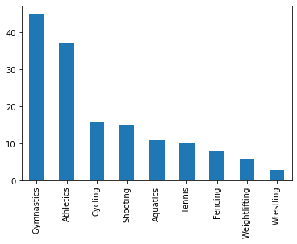


```python
# bar horizontal plot
ds1.plot(kind = 'barh');
```


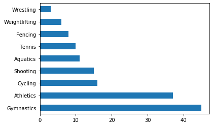


```python
# pie plot
ds1.plot(kind = 'pie');
```


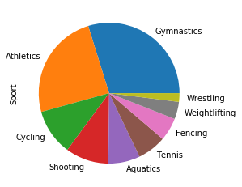


## Plot Colors
`plt.plot(kind='<kind>',color='<col>')`


```python
ds1.plot(kind='bar',color='red');
```


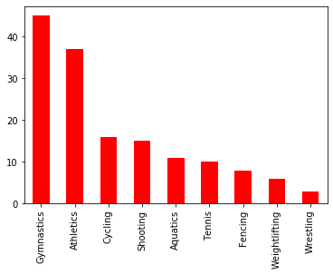


## Figure size
A touple of (X,Y) size in inches 


```python
ds1.plot(figsize=(10,3))
```


    <matplotlib.axes._subplots.AxesSubplot at 0x1a910a7e6a0>


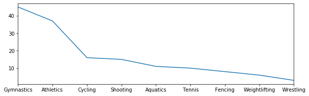


## Colormaps
Three classs of maps
* Sequential  : used for order data 
* Diverging   : when data deviates aroud a middle value 
* Qualitative : unordered color 


```python
ds1.plot(kind='pie', colormap='Pastel1');
```


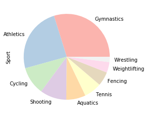


## Seaborn basic plotting 
* a plotting library based on matplotlib, produces reach stat plots
* not a substitute but a complement to matplotlib 
* Integrate with pandas 
* used over matplotlib when complex statistical data is plotted 

### `Countplot()`
* data   : takes the df
* hue    : categorical variable i.e. having a countable number classes
* order  : dermines the sequence for categorical variable
* pallet : color set to use for different values


```python
import seaborn as sns 
```


```python
# how many madels have been won by men and women in olympics history ?
# how may gold, silver and bronze madel are won by each gender ?
```


```python
sns.countplot(data=ds, x='Medal', hue='Gender');
```


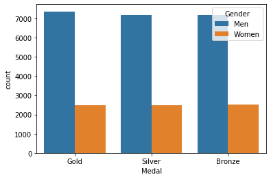


## Problem Exersise
* plot the number of medals achieved by the Chinese team (men, women) in Beijing 2008 using 
    - matplotlib 
    - seaborn
* how can you use colormap to give the data more meaning ? 
* plot the number of glod, silver and bronze medal for each gender 
* how can you give the data more meaning, is there anything you can change ?\


```python
# plot the number of medals achieved by the Chinese team (men, women) in Beijing 2008 using
# matplotlib plot
ds21=ds[ (ds.Edition == 2008) & (ds.NOC == 'CHN') ]['Gender'].value_counts()
ds21.plot(kind='bar');
```


```python
# seaborn plot
ds22=ds[ (ds.Edition == 2008) & (ds.NOC == 'CHN') ]
sns.countplot(data=ds22, x='Gender');
```


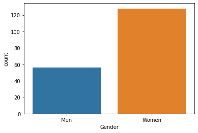


```python
#how can you use colormap to give the data more meaning
ds21.plot(kind='bar',colormap='Paired',colormap=);
```


      File "<ipython-input-46-6d0ae70d6ac4>", line 2
        ds21.plot(kind='bar',colormap='Paired',colormap=);
                                                        ^
    SyntaxError: invalid syntax
    


```python
#plot the number of glod, silver and bronze medal for each gender
sns.countplot(data=ds22, 
              x='Medal', 
              hue='Gender', 
              palette='bwr',
              order=['Gold', 'Silver', 'Bronze']);
```

# Indexing 
* The index object is an immutable array 
* indexing allowes you to access a row or column using label 
* index object has its own type


```python
ds.head()
```


<div>
<style scoped>
    .dataframe tbody tr th:only-of-type {
        vertical-align: middle;
    }

    .dataframe tbody tr th {
        vertical-align: top;
    }

    .dataframe thead th {
        text-align: right;
    }
</style>
<table border="1" class="dataframe">
  <thead>
    <tr style="text-align: right;">
      <th></th>
      <th>City</th>
      <th>Edition</th>
      <th>Sport</th>
      <th>Discipline</th>
      <th>Athlete</th>
      <th>NOC</th>
      <th>Gender</th>
      <th>Event</th>
      <th>Event_gender</th>
      <th>Medal</th>
    </tr>
  </thead>
  <tbody>
    <tr>
      <th>0</th>
      <td>Athens</td>
      <td>1896</td>
      <td>Aquatics</td>
      <td>Swimming</td>
      <td>HAJOS, Alfred</td>
      <td>HUN</td>
      <td>Men</td>
      <td>100m freestyle</td>
      <td>M</td>
      <td>Gold</td>
    </tr>
    <tr>
      <th>1</th>
      <td>Athens</td>
      <td>1896</td>
      <td>Aquatics</td>
      <td>Swimming</td>
      <td>HERSCHMANN, Otto</td>
      <td>AUT</td>
      <td>Men</td>
      <td>100m freestyle</td>
      <td>M</td>
      <td>Silver</td>
    </tr>
    <tr>
      <th>2</th>
      <td>Athens</td>
      <td>1896</td>
      <td>Aquatics</td>
      <td>Swimming</td>
      <td>DRIVAS, Dimitrios</td>
      <td>GRE</td>
      <td>Men</td>
      <td>100m freestyle for sailors</td>
      <td>M</td>
      <td>Bronze</td>
    </tr>
    <tr>
      <th>3</th>
      <td>Athens</td>
      <td>1896</td>
      <td>Aquatics</td>
      <td>Swimming</td>
      <td>MALOKINIS, Ioannis</td>
      <td>GRE</td>
      <td>Men</td>
      <td>100m freestyle for sailors</td>
      <td>M</td>
      <td>Gold</td>
    </tr>
    <tr>
      <th>4</th>
      <td>Athens</td>
      <td>1896</td>
      <td>Aquatics</td>
      <td>Swimming</td>
      <td>CHASAPIS, Spiridon</td>
      <td>GRE</td>
      <td>Men</td>
      <td>100m freestyle for sailors</td>
      <td>M</td>
      <td>Silver</td>
    </tr>
  </tbody>
</table>
</div>


```python
type(ds.index)
```


    pandas.core.indexes.range.RangeIndex


```python
ds.index[100]
```


    100


```python
# index is immutable
ds.index[100] = 5  #error!
```


    ---------------------------------------------------------------------------

    TypeError                                 Traceback (most recent call last)

    <ipython-input-56-01b5fd8fcd8b> in <module>
          1 # index is immutable
    ----> 2 ds.index[100] = 5  #error!
    

    ~\Anaconda3\lib\site-packages\pandas\core\indexes\base.py in __setitem__(self, key, value)
       3936 
       3937     def __setitem__(self, key, value):
    -> 3938         raise TypeError("Index does not support mutable operations")
       3939 
       3940     def __getitem__(self, key):
    

    TypeError: Index does not support mutable operations


## `set_index()`


```python
# set Athlete series as our index
ds.set_index('Athlete').head(3) # this is non-persistent though
```


<div>
<style scoped>
    .dataframe tbody tr th:only-of-type {
        vertical-align: middle;
    }

    .dataframe tbody tr th {
        vertical-align: top;
    }

    .dataframe thead th {
        text-align: right;
    }
</style>
<table border="1" class="dataframe">
  <thead>
    <tr style="text-align: right;">
      <th></th>
      <th>City</th>
      <th>Edition</th>
      <th>Sport</th>
      <th>Discipline</th>
      <th>NOC</th>
      <th>Gender</th>
      <th>Event</th>
      <th>Event_gender</th>
      <th>Medal</th>
    </tr>
    <tr>
      <th>Athlete</th>
      <th></th>
      <th></th>
      <th></th>
      <th></th>
      <th></th>
      <th></th>
      <th></th>
      <th></th>
      <th></th>
    </tr>
  </thead>
  <tbody>
    <tr>
      <th>HAJOS, Alfred</th>
      <td>Athens</td>
      <td>1896</td>
      <td>Aquatics</td>
      <td>Swimming</td>
      <td>HUN</td>
      <td>Men</td>
      <td>100m freestyle</td>
      <td>M</td>
      <td>Gold</td>
    </tr>
    <tr>
      <th>HERSCHMANN, Otto</th>
      <td>Athens</td>
      <td>1896</td>
      <td>Aquatics</td>
      <td>Swimming</td>
      <td>AUT</td>
      <td>Men</td>
      <td>100m freestyle</td>
      <td>M</td>
      <td>Silver</td>
    </tr>
    <tr>
      <th>DRIVAS, Dimitrios</th>
      <td>Athens</td>
      <td>1896</td>
      <td>Aquatics</td>
      <td>Swimming</td>
      <td>GRE</td>
      <td>Men</td>
      <td>100m freestyle for sailors</td>
      <td>M</td>
      <td>Bronze</td>
    </tr>
  </tbody>
</table>
</div>


```python
ds.head(3)
```


<div>
<style scoped>
    .dataframe tbody tr th:only-of-type {
        vertical-align: middle;
    }

    .dataframe tbody tr th {
        vertical-align: top;
    }

    .dataframe thead th {
        text-align: right;
    }
</style>
<table border="1" class="dataframe">
  <thead>
    <tr style="text-align: right;">
      <th></th>
      <th>City</th>
      <th>Edition</th>
      <th>Sport</th>
      <th>Discipline</th>
      <th>Athlete</th>
      <th>NOC</th>
      <th>Gender</th>
      <th>Event</th>
      <th>Event_gender</th>
      <th>Medal</th>
    </tr>
  </thead>
  <tbody>
    <tr>
      <th>0</th>
      <td>Athens</td>
      <td>1896</td>
      <td>Aquatics</td>
      <td>Swimming</td>
      <td>HAJOS, Alfred</td>
      <td>HUN</td>
      <td>Men</td>
      <td>100m freestyle</td>
      <td>M</td>
      <td>Gold</td>
    </tr>
    <tr>
      <th>1</th>
      <td>Athens</td>
      <td>1896</td>
      <td>Aquatics</td>
      <td>Swimming</td>
      <td>HERSCHMANN, Otto</td>
      <td>AUT</td>
      <td>Men</td>
      <td>100m freestyle</td>
      <td>M</td>
      <td>Silver</td>
    </tr>
    <tr>
      <th>2</th>
      <td>Athens</td>
      <td>1896</td>
      <td>Aquatics</td>
      <td>Swimming</td>
      <td>DRIVAS, Dimitrios</td>
      <td>GRE</td>
      <td>Men</td>
      <td>100m freestyle for sailors</td>
      <td>M</td>
      <td>Bronze</td>
    </tr>
  </tbody>
</table>
</div>


```python
ds3=ds.copy()   #copy DS into DS3
```


```python
ds3.set_index('Athlete',inplace=True);  #persistence change 
```


```python
ds3.head(3)  # only ds3 is changed 
```


<div>
<style scoped>
    .dataframe tbody tr th:only-of-type {
        vertical-align: middle;
    }

    .dataframe tbody tr th {
        vertical-align: top;
    }

    .dataframe thead th {
        text-align: right;
    }
</style>
<table border="1" class="dataframe">
  <thead>
    <tr style="text-align: right;">
      <th></th>
      <th>City</th>
      <th>Edition</th>
      <th>Sport</th>
      <th>Discipline</th>
      <th>NOC</th>
      <th>Gender</th>
      <th>Event</th>
      <th>Event_gender</th>
      <th>Medal</th>
    </tr>
    <tr>
      <th>Athlete</th>
      <th></th>
      <th></th>
      <th></th>
      <th></th>
      <th></th>
      <th></th>
      <th></th>
      <th></th>
      <th></th>
    </tr>
  </thead>
  <tbody>
    <tr>
      <th>HAJOS, Alfred</th>
      <td>Athens</td>
      <td>1896</td>
      <td>Aquatics</td>
      <td>Swimming</td>
      <td>HUN</td>
      <td>Men</td>
      <td>100m freestyle</td>
      <td>M</td>
      <td>Gold</td>
    </tr>
    <tr>
      <th>HERSCHMANN, Otto</th>
      <td>Athens</td>
      <td>1896</td>
      <td>Aquatics</td>
      <td>Swimming</td>
      <td>AUT</td>
      <td>Men</td>
      <td>100m freestyle</td>
      <td>M</td>
      <td>Silver</td>
    </tr>
    <tr>
      <th>DRIVAS, Dimitrios</th>
      <td>Athens</td>
      <td>1896</td>
      <td>Aquatics</td>
      <td>Swimming</td>
      <td>GRE</td>
      <td>Men</td>
      <td>100m freestyle for sailors</td>
      <td>M</td>
      <td>Bronze</td>
    </tr>
  </tbody>
</table>
</div>


```python
ds.head(3)  # not DS
```


<div>
<style scoped>
    .dataframe tbody tr th:only-of-type {
        vertical-align: middle;
    }

    .dataframe tbody tr th {
        vertical-align: top;
    }

    .dataframe thead th {
        text-align: right;
    }
</style>
<table border="1" class="dataframe">
  <thead>
    <tr style="text-align: right;">
      <th></th>
      <th>City</th>
      <th>Edition</th>
      <th>Sport</th>
      <th>Discipline</th>
      <th>Athlete</th>
      <th>NOC</th>
      <th>Gender</th>
      <th>Event</th>
      <th>Event_gender</th>
      <th>Medal</th>
    </tr>
  </thead>
  <tbody>
    <tr>
      <th>0</th>
      <td>Athens</td>
      <td>1896</td>
      <td>Aquatics</td>
      <td>Swimming</td>
      <td>HAJOS, Alfred</td>
      <td>HUN</td>
      <td>Men</td>
      <td>100m freestyle</td>
      <td>M</td>
      <td>Gold</td>
    </tr>
    <tr>
      <th>1</th>
      <td>Athens</td>
      <td>1896</td>
      <td>Aquatics</td>
      <td>Swimming</td>
      <td>HERSCHMANN, Otto</td>
      <td>AUT</td>
      <td>Men</td>
      <td>100m freestyle</td>
      <td>M</td>
      <td>Silver</td>
    </tr>
    <tr>
      <th>2</th>
      <td>Athens</td>
      <td>1896</td>
      <td>Aquatics</td>
      <td>Swimming</td>
      <td>DRIVAS, Dimitrios</td>
      <td>GRE</td>
      <td>Men</td>
      <td>100m freestyle for sailors</td>
      <td>M</td>
      <td>Bronze</td>
    </tr>
  </tbody>
</table>
</div>


## `reset_index()`
revert a dataset into its default integetr based index


```python
ds3.head(3)
```


<div>
<style scoped>
    .dataframe tbody tr th:only-of-type {
        vertical-align: middle;
    }

    .dataframe tbody tr th {
        vertical-align: top;
    }

    .dataframe thead th {
        text-align: right;
    }
</style>
<table border="1" class="dataframe">
  <thead>
    <tr style="text-align: right;">
      <th></th>
      <th>City</th>
      <th>Edition</th>
      <th>Sport</th>
      <th>Discipline</th>
      <th>NOC</th>
      <th>Gender</th>
      <th>Event</th>
      <th>Event_gender</th>
      <th>Medal</th>
    </tr>
    <tr>
      <th>Athlete</th>
      <th></th>
      <th></th>
      <th></th>
      <th></th>
      <th></th>
      <th></th>
      <th></th>
      <th></th>
      <th></th>
    </tr>
  </thead>
  <tbody>
    <tr>
      <th>HAJOS, Alfred</th>
      <td>Athens</td>
      <td>1896</td>
      <td>Aquatics</td>
      <td>Swimming</td>
      <td>HUN</td>
      <td>Men</td>
      <td>100m freestyle</td>
      <td>M</td>
      <td>Gold</td>
    </tr>
    <tr>
      <th>HERSCHMANN, Otto</th>
      <td>Athens</td>
      <td>1896</td>
      <td>Aquatics</td>
      <td>Swimming</td>
      <td>AUT</td>
      <td>Men</td>
      <td>100m freestyle</td>
      <td>M</td>
      <td>Silver</td>
    </tr>
    <tr>
      <th>DRIVAS, Dimitrios</th>
      <td>Athens</td>
      <td>1896</td>
      <td>Aquatics</td>
      <td>Swimming</td>
      <td>GRE</td>
      <td>Men</td>
      <td>100m freestyle for sailors</td>
      <td>M</td>
      <td>Bronze</td>
    </tr>
  </tbody>
</table>
</div>


```python
ds3.reset_index(inplace=True)
```


```python
ds3.head(3)
```


<div>
<style scoped>
    .dataframe tbody tr th:only-of-type {
        vertical-align: middle;
    }

    .dataframe tbody tr th {
        vertical-align: top;
    }

    .dataframe thead th {
        text-align: right;
    }
</style>
<table border="1" class="dataframe">
  <thead>
    <tr style="text-align: right;">
      <th></th>
      <th>Athlete</th>
      <th>City</th>
      <th>Edition</th>
      <th>Sport</th>
      <th>Discipline</th>
      <th>NOC</th>
      <th>Gender</th>
      <th>Event</th>
      <th>Event_gender</th>
      <th>Medal</th>
    </tr>
  </thead>
  <tbody>
    <tr>
      <th>0</th>
      <td>HAJOS, Alfred</td>
      <td>Athens</td>
      <td>1896</td>
      <td>Aquatics</td>
      <td>Swimming</td>
      <td>HUN</td>
      <td>Men</td>
      <td>100m freestyle</td>
      <td>M</td>
      <td>Gold</td>
    </tr>
    <tr>
      <th>1</th>
      <td>HERSCHMANN, Otto</td>
      <td>Athens</td>
      <td>1896</td>
      <td>Aquatics</td>
      <td>Swimming</td>
      <td>AUT</td>
      <td>Men</td>
      <td>100m freestyle</td>
      <td>M</td>
      <td>Silver</td>
    </tr>
    <tr>
      <th>2</th>
      <td>DRIVAS, Dimitrios</td>
      <td>Athens</td>
      <td>1896</td>
      <td>Aquatics</td>
      <td>Swimming</td>
      <td>GRE</td>
      <td>Men</td>
      <td>100m freestyle for sailors</td>
      <td>M</td>
      <td>Bronze</td>
    </tr>
  </tbody>
</table>
</div>


## `sort_index()`
sorted index is faster to be accessed, especially when accessing a subset 


```python
ds3.head(3)
```


<div>
<style scoped>
    .dataframe tbody tr th:only-of-type {
        vertical-align: middle;
    }

    .dataframe tbody tr th {
        vertical-align: top;
    }

    .dataframe thead th {
        text-align: right;
    }
</style>
<table border="1" class="dataframe">
  <thead>
    <tr style="text-align: right;">
      <th></th>
      <th>Athlete</th>
      <th>City</th>
      <th>Edition</th>
      <th>Sport</th>
      <th>Discipline</th>
      <th>NOC</th>
      <th>Gender</th>
      <th>Event</th>
      <th>Event_gender</th>
      <th>Medal</th>
    </tr>
  </thead>
  <tbody>
    <tr>
      <th>0</th>
      <td>HAJOS, Alfred</td>
      <td>Athens</td>
      <td>1896</td>
      <td>Aquatics</td>
      <td>Swimming</td>
      <td>HUN</td>
      <td>Men</td>
      <td>100m freestyle</td>
      <td>M</td>
      <td>Gold</td>
    </tr>
    <tr>
      <th>1</th>
      <td>HERSCHMANN, Otto</td>
      <td>Athens</td>
      <td>1896</td>
      <td>Aquatics</td>
      <td>Swimming</td>
      <td>AUT</td>
      <td>Men</td>
      <td>100m freestyle</td>
      <td>M</td>
      <td>Silver</td>
    </tr>
    <tr>
      <th>2</th>
      <td>DRIVAS, Dimitrios</td>
      <td>Athens</td>
      <td>1896</td>
      <td>Aquatics</td>
      <td>Swimming</td>
      <td>GRE</td>
      <td>Men</td>
      <td>100m freestyle for sailors</td>
      <td>M</td>
      <td>Bronze</td>
    </tr>
  </tbody>
</table>
</div>


```python
#set the index to Athlete
ds3.set_index('Athlete',inplace=True)
ds3.head(3)
```


<div>
<style scoped>
    .dataframe tbody tr th:only-of-type {
        vertical-align: middle;
    }

    .dataframe tbody tr th {
        vertical-align: top;
    }

    .dataframe thead th {
        text-align: right;
    }
</style>
<table border="1" class="dataframe">
  <thead>
    <tr style="text-align: right;">
      <th></th>
      <th>City</th>
      <th>Edition</th>
      <th>Sport</th>
      <th>Discipline</th>
      <th>NOC</th>
      <th>Gender</th>
      <th>Event</th>
      <th>Event_gender</th>
      <th>Medal</th>
    </tr>
    <tr>
      <th>Athlete</th>
      <th></th>
      <th></th>
      <th></th>
      <th></th>
      <th></th>
      <th></th>
      <th></th>
      <th></th>
      <th></th>
    </tr>
  </thead>
  <tbody>
    <tr>
      <th>BAROEV, Khasan</th>
      <td>Beijing</td>
      <td>2008</td>
      <td>Wrestling</td>
      <td>Wrestling Gre-R</td>
      <td>RUS</td>
      <td>Men</td>
      <td>96 - 120kg</td>
      <td>M</td>
      <td>Silver</td>
    </tr>
    <tr>
      <th>LOPEZ, Mijain</th>
      <td>Beijing</td>
      <td>2008</td>
      <td>Wrestling</td>
      <td>Wrestling Gre-R</td>
      <td>CUB</td>
      <td>Men</td>
      <td>96 - 120kg</td>
      <td>M</td>
      <td>Gold</td>
    </tr>
    <tr>
      <th>PATRIKEEV, Yuri</th>
      <td>Beijing</td>
      <td>2008</td>
      <td>Wrestling</td>
      <td>Wrestling Gre-R</td>
      <td>ARM</td>
      <td>Men</td>
      <td>96 - 120kg</td>
      <td>M</td>
      <td>Bronze</td>
    </tr>
  </tbody>
</table>
</div>


```python
ds3.sort_index(inplace=True, ascending=True);
ds3.head()
```


<div>
<style scoped>
    .dataframe tbody tr th:only-of-type {
        vertical-align: middle;
    }

    .dataframe tbody tr th {
        vertical-align: top;
    }

    .dataframe thead th {
        text-align: right;
    }
</style>
<table border="1" class="dataframe">
  <thead>
    <tr style="text-align: right;">
      <th></th>
      <th>City</th>
      <th>Edition</th>
      <th>Sport</th>
      <th>Discipline</th>
      <th>NOC</th>
      <th>Gender</th>
      <th>Event</th>
      <th>Event_gender</th>
      <th>Medal</th>
    </tr>
    <tr>
      <th>Athlete</th>
      <th></th>
      <th></th>
      <th></th>
      <th></th>
      <th></th>
      <th></th>
      <th></th>
      <th></th>
      <th></th>
    </tr>
  </thead>
  <tbody>
    <tr>
      <th>AABYE, Edgar</th>
      <td>Paris</td>
      <td>1900</td>
      <td>Tug of War</td>
      <td>Tug of War</td>
      <td>ZZX</td>
      <td>Men</td>
      <td>tug of war</td>
      <td>M</td>
      <td>Gold</td>
    </tr>
    <tr>
      <th>AALTONEN, Arvo Ossian</th>
      <td>Antwerp</td>
      <td>1920</td>
      <td>Aquatics</td>
      <td>Swimming</td>
      <td>FIN</td>
      <td>Men</td>
      <td>400m breaststroke</td>
      <td>M</td>
      <td>Bronze</td>
    </tr>
    <tr>
      <th>AALTONEN, Arvo Ossian</th>
      <td>Antwerp</td>
      <td>1920</td>
      <td>Aquatics</td>
      <td>Swimming</td>
      <td>FIN</td>
      <td>Men</td>
      <td>200m breaststroke</td>
      <td>M</td>
      <td>Bronze</td>
    </tr>
    <tr>
      <th>AALTONEN, Paavo Johannes</th>
      <td>London</td>
      <td>1948</td>
      <td>Gymnastics</td>
      <td>Artistic G.</td>
      <td>FIN</td>
      <td>Men</td>
      <td>team competition</td>
      <td>M</td>
      <td>Gold</td>
    </tr>
    <tr>
      <th>AALTONEN, Paavo Johannes</th>
      <td>London</td>
      <td>1948</td>
      <td>Gymnastics</td>
      <td>Artistic G.</td>
      <td>FIN</td>
      <td>Men</td>
      <td>pommel horse</td>
      <td>M</td>
      <td>Gold</td>
    </tr>
  </tbody>
</table>
</div>


## `loc[]`
* loc is a label based indexing 
* raises key error when items are not found 
* make sure searched label must be in index column


```python
ds3.loc['BOLT, Usain']
```


<div>
<style scoped>
    .dataframe tbody tr th:only-of-type {
        vertical-align: middle;
    }

    .dataframe tbody tr th {
        vertical-align: top;
    }

    .dataframe thead th {
        text-align: right;
    }
</style>
<table border="1" class="dataframe">
  <thead>
    <tr style="text-align: right;">
      <th></th>
      <th>City</th>
      <th>Edition</th>
      <th>Sport</th>
      <th>Discipline</th>
      <th>NOC</th>
      <th>Gender</th>
      <th>Event</th>
      <th>Event_gender</th>
      <th>Medal</th>
    </tr>
    <tr>
      <th>Athlete</th>
      <th></th>
      <th></th>
      <th></th>
      <th></th>
      <th></th>
      <th></th>
      <th></th>
      <th></th>
      <th></th>
    </tr>
  </thead>
  <tbody>
    <tr>
      <th>BOLT, Usain</th>
      <td>Beijing</td>
      <td>2008</td>
      <td>Athletics</td>
      <td>Athletics</td>
      <td>JAM</td>
      <td>Men</td>
      <td>100m</td>
      <td>M</td>
      <td>Gold</td>
    </tr>
    <tr>
      <th>BOLT, Usain</th>
      <td>Beijing</td>
      <td>2008</td>
      <td>Athletics</td>
      <td>Athletics</td>
      <td>JAM</td>
      <td>Men</td>
      <td>200m</td>
      <td>M</td>
      <td>Gold</td>
    </tr>
    <tr>
      <th>BOLT, Usain</th>
      <td>Beijing</td>
      <td>2008</td>
      <td>Athletics</td>
      <td>Athletics</td>
      <td>JAM</td>
      <td>Men</td>
      <td>4x100m relay</td>
      <td>M</td>
      <td>Gold</td>
    </tr>
  </tbody>
</table>
</div>


##  `iloc[]`
* integer based indexing 
* it supports traditional pythonic slicing 
* works still if the index is set to an alphanumeric attribute 


```python
ds3.head(1)
```


<div>
<style scoped>
    .dataframe tbody tr th:only-of-type {
        vertical-align: middle;
    }

    .dataframe tbody tr th {
        vertical-align: top;
    }

    .dataframe thead th {
        text-align: right;
    }
</style>
<table border="1" class="dataframe">
  <thead>
    <tr style="text-align: right;">
      <th></th>
      <th>City</th>
      <th>Edition</th>
      <th>Sport</th>
      <th>Discipline</th>
      <th>NOC</th>
      <th>Gender</th>
      <th>Event</th>
      <th>Event_gender</th>
      <th>Medal</th>
    </tr>
    <tr>
      <th>Athlete</th>
      <th></th>
      <th></th>
      <th></th>
      <th></th>
      <th></th>
      <th></th>
      <th></th>
      <th></th>
      <th></th>
    </tr>
  </thead>
  <tbody>
    <tr>
      <th>AABYE, Edgar</th>
      <td>Paris</td>
      <td>1900</td>
      <td>Tug of War</td>
      <td>Tug of War</td>
      <td>ZZX</td>
      <td>Men</td>
      <td>tug of war</td>
      <td>M</td>
      <td>Gold</td>
    </tr>
  </tbody>
</table>
</div>


```python
ds3.iloc[0]    # notice index value is not included 
```


    City                 Paris
    Edition               1900
    Sport           Tug of War
    Discipline      Tug of War
    NOC                    ZZX
    Gender                 Men
    Event           tug of war
    Event_gender             M
    Medal                 Gold
    Name: AABYE, Edgar, dtype: object


```python
ds3.reset_index(inplace=True)
```


```python
ds3.iloc[[0,2,5]]  # multiple rows with an index list 
```


<div>
<style scoped>
    .dataframe tbody tr th:only-of-type {
        vertical-align: middle;
    }

    .dataframe tbody tr th {
        vertical-align: top;
    }

    .dataframe thead th {
        text-align: right;
    }
</style>
<table border="1" class="dataframe">
  <thead>
    <tr style="text-align: right;">
      <th></th>
      <th>Athlete</th>
      <th>City</th>
      <th>Edition</th>
      <th>Sport</th>
      <th>Discipline</th>
      <th>NOC</th>
      <th>Gender</th>
      <th>Event</th>
      <th>Event_gender</th>
      <th>Medal</th>
    </tr>
  </thead>
  <tbody>
    <tr>
      <th>0</th>
      <td>AABYE, Edgar</td>
      <td>Paris</td>
      <td>1900</td>
      <td>Tug of War</td>
      <td>Tug of War</td>
      <td>ZZX</td>
      <td>Men</td>
      <td>tug of war</td>
      <td>M</td>
      <td>Gold</td>
    </tr>
    <tr>
      <th>2</th>
      <td>AALTONEN, Arvo Ossian</td>
      <td>Antwerp</td>
      <td>1920</td>
      <td>Aquatics</td>
      <td>Swimming</td>
      <td>FIN</td>
      <td>Men</td>
      <td>200m breaststroke</td>
      <td>M</td>
      <td>Bronze</td>
    </tr>
    <tr>
      <th>5</th>
      <td>AALTONEN, Paavo Johannes</td>
      <td>London</td>
      <td>1948</td>
      <td>Gymnastics</td>
      <td>Artistic G.</td>
      <td>FIN</td>
      <td>Men</td>
      <td>individual all-round</td>
      <td>M</td>
      <td>Bronze</td>
    </tr>
  </tbody>
</table>
</div>


```python
ds3.iloc[2:10:2] # pythocinc slicing [start : end : step]
```


<div>
<style scoped>
    .dataframe tbody tr th:only-of-type {
        vertical-align: middle;
    }

    .dataframe tbody tr th {
        vertical-align: top;
    }

    .dataframe thead th {
        text-align: right;
    }
</style>
<table border="1" class="dataframe">
  <thead>
    <tr style="text-align: right;">
      <th></th>
      <th>Athlete</th>
      <th>City</th>
      <th>Edition</th>
      <th>Sport</th>
      <th>Discipline</th>
      <th>NOC</th>
      <th>Gender</th>
      <th>Event</th>
      <th>Event_gender</th>
      <th>Medal</th>
    </tr>
  </thead>
  <tbody>
    <tr>
      <th>2</th>
      <td>AALTONEN, Arvo Ossian</td>
      <td>Antwerp</td>
      <td>1920</td>
      <td>Aquatics</td>
      <td>Swimming</td>
      <td>FIN</td>
      <td>Men</td>
      <td>200m breaststroke</td>
      <td>M</td>
      <td>Bronze</td>
    </tr>
    <tr>
      <th>4</th>
      <td>AALTONEN, Paavo Johannes</td>
      <td>London</td>
      <td>1948</td>
      <td>Gymnastics</td>
      <td>Artistic G.</td>
      <td>FIN</td>
      <td>Men</td>
      <td>pommel horse</td>
      <td>M</td>
      <td>Gold</td>
    </tr>
    <tr>
      <th>6</th>
      <td>AALTONEN, Paavo Johannes</td>
      <td>Helsinki</td>
      <td>1952</td>
      <td>Gymnastics</td>
      <td>Artistic G.</td>
      <td>FIN</td>
      <td>Men</td>
      <td>team competition</td>
      <td>M</td>
      <td>Bronze</td>
    </tr>
    <tr>
      <th>8</th>
      <td>AAMODT, Ragnhild</td>
      <td>Beijing</td>
      <td>2008</td>
      <td>Handball</td>
      <td>Handball</td>
      <td>NOR</td>
      <td>Women</td>
      <td>handball</td>
      <td>W</td>
      <td>Gold</td>
    </tr>
  </tbody>
</table>
</div>


## Problem Excersise
1. plot the total number of medals awarded to each of the Olympic games throughout history 
2. which countries did not win any medals in 2008
3. how many countries were there


```python
#plot the total number of medals awarded to each of the Olympic games throughout history
plt.subplots(figsize=(20,5))
plt.grid(True)
sns.countplot(data=ds, x='Edition');
```


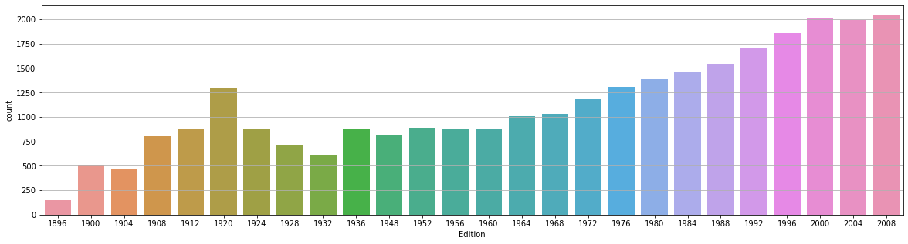


```python
# which countries did not win any medals in 2008

noc = set(ds.NOC.tolist())    # list of all countries throught history
noc_08 = set(ds[ ds.Edition == 2008 ].NOC.tolist() ) #list of all countries won a medal at 2008
sorted(list(noc.difference(noc_08))) # differece 
```


    ['AHO',
     'ANZ',
     'BAR',
     'BDI',
     'BER',
     'BOH',
     'BWI',
     'CIV',
     'CRC',
     'DJI',
     'ERI',
     'EUA',
     'EUN',
     'FRG',
     'GDR',
     'GHA',
     'GUY',
     'HAI',
     'HKG',
     'IOP',
     'IRQ',
     'ISV',
     'KSA',
     'KUW',
     'LIB',
     'LUX',
     'MKD',
     'MOZ',
     'NAM',
     'NIG',
     'PAK',
     'PAR',
     'PER',
     'PHI',
     'PUR',
     'QAT',
     'RU1',
     'SCG',
     'SEN',
     'SRI',
     'SUR',
     'SYR',
     'TAN',
     'TCH',
     'TGA',
     'UAE',
     'UGA',
     'URS',
     'URU',
     'YUG',
     'ZAM',
     'ZZX']


# Groupby
* split df into groups based on criteria
* apply function to each group independently 
* combines the results to group by objec (dict like)


```python
type(ds.groupby('Edition'))
```


    pandas.core.groupby.generic.DataFrameGroupBy


The group by object holds a dict list structure, keyed by the group by claus and valued by the matched df 


```python
for group_key , group_value in ds.groupby('Edition'):
    print(f'key = {group_key} : val_type = {type(group_value)}')
```

    key = 1896 : val_type = <class 'pandas.core.frame.DataFrame'>
    key = 1900 : val_type = <class 'pandas.core.frame.DataFrame'>
    key = 1904 : val_type = <class 'pandas.core.frame.DataFrame'>
    key = 1908 : val_type = <class 'pandas.core.frame.DataFrame'>
    key = 1912 : val_type = <class 'pandas.core.frame.DataFrame'>
    key = 1920 : val_type = <class 'pandas.core.frame.DataFrame'>
    key = 1924 : val_type = <class 'pandas.core.frame.DataFrame'>
    key = 1928 : val_type = <class 'pandas.core.frame.DataFrame'>
    key = 1932 : val_type = <class 'pandas.core.frame.DataFrame'>
    key = 1936 : val_type = <class 'pandas.core.frame.DataFrame'>
    key = 1948 : val_type = <class 'pandas.core.frame.DataFrame'>
    key = 1952 : val_type = <class 'pandas.core.frame.DataFrame'>
    key = 1956 : val_type = <class 'pandas.core.frame.DataFrame'>
    key = 1960 : val_type = <class 'pandas.core.frame.DataFrame'>
    key = 1964 : val_type = <class 'pandas.core.frame.DataFrame'>
    key = 1968 : val_type = <class 'pandas.core.frame.DataFrame'>
    key = 1972 : val_type = <class 'pandas.core.frame.DataFrame'>
    key = 1976 : val_type = <class 'pandas.core.frame.DataFrame'>
    key = 1980 : val_type = <class 'pandas.core.frame.DataFrame'>
    key = 1984 : val_type = <class 'pandas.core.frame.DataFrame'>
    key = 1988 : val_type = <class 'pandas.core.frame.DataFrame'>
    key = 1992 : val_type = <class 'pandas.core.frame.DataFrame'>
    key = 1996 : val_type = <class 'pandas.core.frame.DataFrame'>
    key = 2000 : val_type = <class 'pandas.core.frame.DataFrame'>
    key = 2004 : val_type = <class 'pandas.core.frame.DataFrame'>
    key = 2008 : val_type = <class 'pandas.core.frame.DataFrame'>
    

Understanding group by with multiple colum names, create a composite primary key and groups for each unique combination of keyed attributes 

## groupby computation 

### `size()`
counts size of a every group 


```python
ds.groupby('Edition').size()
```


    Edition
    1896     151
    1900     512
    1904     470
    1908     804
    1912     885
    1920    1298
    1924     884
    1928     710
    1932     615
    1936     875
    1948     814
    1952     889
    1956     885
    1960     882
    1964    1010
    1968    1031
    1972    1185
    1976    1305
    1980    1387
    1984    1459
    1988    1546
    1992    1705
    1996    1859
    2000    2015
    2004    1998
    2008    2042
    dtype: int64


### `agg([...])` 
calculate multiple stats for each group in one computation


```python
ds.groupby( ['Edition', 'NOC', 'Medal'] ).agg({'Edition' : ['min','max','count']})
```


<div>
<style scoped>
    .dataframe tbody tr th:only-of-type {
        vertical-align: middle;
    }

    .dataframe tbody tr th {
        vertical-align: top;
    }

    .dataframe thead tr th {
        text-align: left;
    }

    .dataframe thead tr:last-of-type th {
        text-align: right;
    }
</style>
<table border="1" class="dataframe">
  <thead>
    <tr>
      <th></th>
      <th></th>
      <th></th>
      <th colspan="3" halign="left">Edition</th>
    </tr>
    <tr>
      <th></th>
      <th></th>
      <th></th>
      <th>min</th>
      <th>max</th>
      <th>count</th>
    </tr>
    <tr>
      <th>Edition</th>
      <th>NOC</th>
      <th>Medal</th>
      <th></th>
      <th></th>
      <th></th>
    </tr>
  </thead>
  <tbody>
    <tr>
      <th rowspan="30" valign="top">1896</th>
      <th>AUS</th>
      <th>Gold</th>
      <td>1896</td>
      <td>1896</td>
      <td>2</td>
    </tr>
    <tr>
      <th rowspan="3" valign="top">AUT</th>
      <th>Bronze</th>
      <td>1896</td>
      <td>1896</td>
      <td>2</td>
    </tr>
    <tr>
      <th>Gold</th>
      <td>1896</td>
      <td>1896</td>
      <td>2</td>
    </tr>
    <tr>
      <th>Silver</th>
      <td>1896</td>
      <td>1896</td>
      <td>1</td>
    </tr>
    <tr>
      <th rowspan="3" valign="top">DEN</th>
      <th>Bronze</th>
      <td>1896</td>
      <td>1896</td>
      <td>3</td>
    </tr>
    <tr>
      <th>Gold</th>
      <td>1896</td>
      <td>1896</td>
      <td>1</td>
    </tr>
    <tr>
      <th>Silver</th>
      <td>1896</td>
      <td>1896</td>
      <td>2</td>
    </tr>
    <tr>
      <th rowspan="3" valign="top">FRA</th>
      <th>Bronze</th>
      <td>1896</td>
      <td>1896</td>
      <td>2</td>
    </tr>
    <tr>
      <th>Gold</th>
      <td>1896</td>
      <td>1896</td>
      <td>5</td>
    </tr>
    <tr>
      <th>Silver</th>
      <td>1896</td>
      <td>1896</td>
      <td>4</td>
    </tr>
    <tr>
      <th rowspan="3" valign="top">GBR</th>
      <th>Bronze</th>
      <td>1896</td>
      <td>1896</td>
      <td>2</td>
    </tr>
    <tr>
      <th>Gold</th>
      <td>1896</td>
      <td>1896</td>
      <td>2</td>
    </tr>
    <tr>
      <th>Silver</th>
      <td>1896</td>
      <td>1896</td>
      <td>3</td>
    </tr>
    <tr>
      <th rowspan="3" valign="top">GER</th>
      <th>Bronze</th>
      <td>1896</td>
      <td>1896</td>
      <td>2</td>
    </tr>
    <tr>
      <th>Gold</th>
      <td>1896</td>
      <td>1896</td>
      <td>26</td>
    </tr>
    <tr>
      <th>Silver</th>
      <td>1896</td>
      <td>1896</td>
      <td>5</td>
    </tr>
    <tr>
      <th rowspan="3" valign="top">GRE</th>
      <th>Bronze</th>
      <td>1896</td>
      <td>1896</td>
      <td>22</td>
    </tr>
    <tr>
      <th>Gold</th>
      <td>1896</td>
      <td>1896</td>
      <td>10</td>
    </tr>
    <tr>
      <th>Silver</th>
      <td>1896</td>
      <td>1896</td>
      <td>20</td>
    </tr>
    <tr>
      <th rowspan="3" valign="top">HUN</th>
      <th>Bronze</th>
      <td>1896</td>
      <td>1896</td>
      <td>3</td>
    </tr>
    <tr>
      <th>Gold</th>
      <td>1896</td>
      <td>1896</td>
      <td>2</td>
    </tr>
    <tr>
      <th>Silver</th>
      <td>1896</td>
      <td>1896</td>
      <td>1</td>
    </tr>
    <tr>
      <th rowspan="2" valign="top">SUI</th>
      <th>Gold</th>
      <td>1896</td>
      <td>1896</td>
      <td>1</td>
    </tr>
    <tr>
      <th>Silver</th>
      <td>1896</td>
      <td>1896</td>
      <td>2</td>
    </tr>
    <tr>
      <th rowspan="3" valign="top">USA</th>
      <th>Bronze</th>
      <td>1896</td>
      <td>1896</td>
      <td>2</td>
    </tr>
    <tr>
      <th>Gold</th>
      <td>1896</td>
      <td>1896</td>
      <td>11</td>
    </tr>
    <tr>
      <th>Silver</th>
      <td>1896</td>
      <td>1896</td>
      <td>7</td>
    </tr>
    <tr>
      <th rowspan="3" valign="top">ZZX</th>
      <th>Bronze</th>
      <td>1896</td>
      <td>1896</td>
      <td>2</td>
    </tr>
    <tr>
      <th>Gold</th>
      <td>1896</td>
      <td>1896</td>
      <td>2</td>
    </tr>
    <tr>
      <th>Silver</th>
      <td>1896</td>
      <td>1896</td>
      <td>2</td>
    </tr>
    <tr>
      <th>...</th>
      <th>...</th>
      <th>...</th>
      <td>...</td>
      <td>...</td>
      <td>...</td>
    </tr>
    <tr>
      <th rowspan="30" valign="top">2008</th>
      <th>SUI</th>
      <th>Gold</th>
      <td>2008</td>
      <td>2008</td>
      <td>3</td>
    </tr>
    <tr>
      <th rowspan="3" valign="top">SVK</th>
      <th>Bronze</th>
      <td>2008</td>
      <td>2008</td>
      <td>1</td>
    </tr>
    <tr>
      <th>Gold</th>
      <td>2008</td>
      <td>2008</td>
      <td>4</td>
    </tr>
    <tr>
      <th>Silver</th>
      <td>2008</td>
      <td>2008</td>
      <td>5</td>
    </tr>
    <tr>
      <th rowspan="2" valign="top">SWE</th>
      <th>Bronze</th>
      <td>2008</td>
      <td>2008</td>
      <td>2</td>
    </tr>
    <tr>
      <th>Silver</th>
      <td>2008</td>
      <td>2008</td>
      <td>5</td>
    </tr>
    <tr>
      <th rowspan="2" valign="top">THA</th>
      <th>Gold</th>
      <td>2008</td>
      <td>2008</td>
      <td>2</td>
    </tr>
    <tr>
      <th>Silver</th>
      <td>2008</td>
      <td>2008</td>
      <td>2</td>
    </tr>
    <tr>
      <th rowspan="2" valign="top">TJK</th>
      <th>Bronze</th>
      <td>2008</td>
      <td>2008</td>
      <td>1</td>
    </tr>
    <tr>
      <th>Silver</th>
      <td>2008</td>
      <td>2008</td>
      <td>1</td>
    </tr>
    <tr>
      <th>TOG</th>
      <th>Bronze</th>
      <td>2008</td>
      <td>2008</td>
      <td>1</td>
    </tr>
    <tr>
      <th>TPE</th>
      <th>Bronze</th>
      <td>2008</td>
      <td>2008</td>
      <td>4</td>
    </tr>
    <tr>
      <th>TRI</th>
      <th>Silver</th>
      <td>2008</td>
      <td>2008</td>
      <td>5</td>
    </tr>
    <tr>
      <th>TUN</th>
      <th>Gold</th>
      <td>2008</td>
      <td>2008</td>
      <td>1</td>
    </tr>
    <tr>
      <th rowspan="3" valign="top">TUR</th>
      <th>Bronze</th>
      <td>2008</td>
      <td>2008</td>
      <td>3</td>
    </tr>
    <tr>
      <th>Gold</th>
      <td>2008</td>
      <td>2008</td>
      <td>1</td>
    </tr>
    <tr>
      <th>Silver</th>
      <td>2008</td>
      <td>2008</td>
      <td>4</td>
    </tr>
    <tr>
      <th rowspan="3" valign="top">UKR</th>
      <th>Bronze</th>
      <td>2008</td>
      <td>2008</td>
      <td>16</td>
    </tr>
    <tr>
      <th>Gold</th>
      <td>2008</td>
      <td>2008</td>
      <td>10</td>
    </tr>
    <tr>
      <th>Silver</th>
      <td>2008</td>
      <td>2008</td>
      <td>5</td>
    </tr>
    <tr>
      <th rowspan="3" valign="top">USA</th>
      <th>Bronze</th>
      <td>2008</td>
      <td>2008</td>
      <td>81</td>
    </tr>
    <tr>
      <th>Gold</th>
      <td>2008</td>
      <td>2008</td>
      <td>125</td>
    </tr>
    <tr>
      <th>Silver</th>
      <td>2008</td>
      <td>2008</td>
      <td>109</td>
    </tr>
    <tr>
      <th rowspan="3" valign="top">UZB</th>
      <th>Bronze</th>
      <td>2008</td>
      <td>2008</td>
      <td>3</td>
    </tr>
    <tr>
      <th>Gold</th>
      <td>2008</td>
      <td>2008</td>
      <td>1</td>
    </tr>
    <tr>
      <th>Silver</th>
      <td>2008</td>
      <td>2008</td>
      <td>2</td>
    </tr>
    <tr>
      <th>VEN</th>
      <th>Bronze</th>
      <td>2008</td>
      <td>2008</td>
      <td>1</td>
    </tr>
    <tr>
      <th>VIE</th>
      <th>Silver</th>
      <td>2008</td>
      <td>2008</td>
      <td>1</td>
    </tr>
    <tr>
      <th rowspan="2" valign="top">ZIM</th>
      <th>Gold</th>
      <td>2008</td>
      <td>2008</td>
      <td>1</td>
    </tr>
    <tr>
      <th>Silver</th>
      <td>2008</td>
      <td>2008</td>
      <td>3</td>
    </tr>
  </tbody>
</table>
<p>2356 rows × 3 columns</p>
</div>


## Problem Excersise
1. list the total number of medal given to every year throughout history 
2. list total number of medal won by any country throughout history 


```python
#list the total number of medal given to every year throughout history

ds.groupby('Edition').agg({'Edition':'count'}).plot(kind='barh',figsize=(10,10));
```


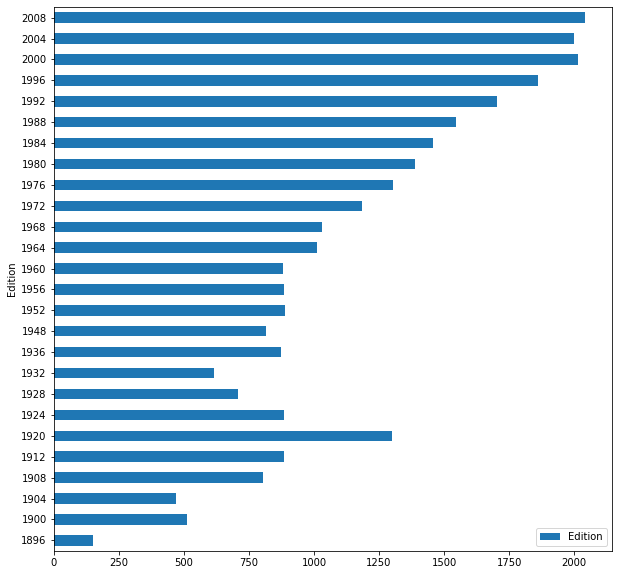


```python
#list total number of medal won by any country throughout history
ds.groupby('NOC').agg({'NOC':'count'}).plot(kind='barh',figsize=(10,20))
```


    <matplotlib.axes._subplots.AxesSubplot at 0x1a92266aa58>


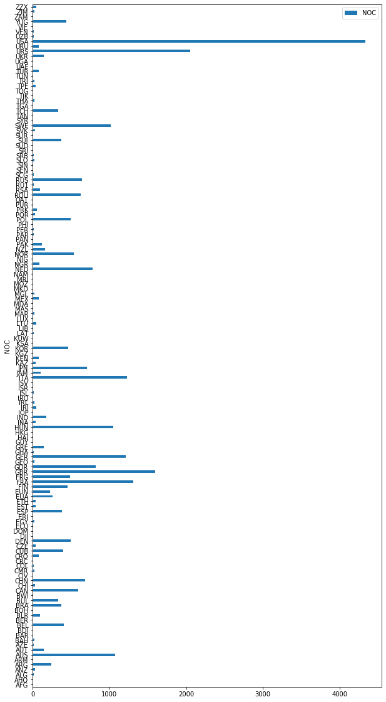


## Reshaping 


```python
#athlete that took part in Beijing olympic 100m or 200m event 
bj_100_200 = ds[ (ds.City == 'Beijing') & ((ds.Event == '100m') | (ds.Event == '200m'))]
bj_100_200
```


<div>
<style scoped>
    .dataframe tbody tr th:only-of-type {
        vertical-align: middle;
    }

    .dataframe tbody tr th {
        vertical-align: top;
    }

    .dataframe thead th {
        text-align: right;
    }
</style>
<table border="1" class="dataframe">
  <thead>
    <tr style="text-align: right;">
      <th></th>
      <th>City</th>
      <th>Edition</th>
      <th>Sport</th>
      <th>Discipline</th>
      <th>Athlete</th>
      <th>NOC</th>
      <th>Gender</th>
      <th>Event</th>
      <th>Event_gender</th>
      <th>Medal</th>
    </tr>
  </thead>
  <tbody>
    <tr>
      <th>27551</th>
      <td>Beijing</td>
      <td>2008</td>
      <td>Athletics</td>
      <td>Athletics</td>
      <td>DIX, Walter</td>
      <td>USA</td>
      <td>Men</td>
      <td>100m</td>
      <td>M</td>
      <td>Bronze</td>
    </tr>
    <tr>
      <th>27552</th>
      <td>Beijing</td>
      <td>2008</td>
      <td>Athletics</td>
      <td>Athletics</td>
      <td>BOLT, Usain</td>
      <td>JAM</td>
      <td>Men</td>
      <td>100m</td>
      <td>M</td>
      <td>Gold</td>
    </tr>
    <tr>
      <th>27553</th>
      <td>Beijing</td>
      <td>2008</td>
      <td>Athletics</td>
      <td>Athletics</td>
      <td>THOMPSON, Richard</td>
      <td>TRI</td>
      <td>Men</td>
      <td>100m</td>
      <td>M</td>
      <td>Silver</td>
    </tr>
    <tr>
      <th>27554</th>
      <td>Beijing</td>
      <td>2008</td>
      <td>Athletics</td>
      <td>Athletics</td>
      <td>FRASER, Shelly-ann</td>
      <td>JAM</td>
      <td>Women</td>
      <td>100m</td>
      <td>W</td>
      <td>Gold</td>
    </tr>
    <tr>
      <th>27555</th>
      <td>Beijing</td>
      <td>2008</td>
      <td>Athletics</td>
      <td>Athletics</td>
      <td>SIMPSON, Sherone</td>
      <td>JAM</td>
      <td>Women</td>
      <td>100m</td>
      <td>W</td>
      <td>Silver</td>
    </tr>
    <tr>
      <th>27556</th>
      <td>Beijing</td>
      <td>2008</td>
      <td>Athletics</td>
      <td>Athletics</td>
      <td>STEWART, Kerron</td>
      <td>JAM</td>
      <td>Women</td>
      <td>100m</td>
      <td>W</td>
      <td>Silver</td>
    </tr>
    <tr>
      <th>27569</th>
      <td>Beijing</td>
      <td>2008</td>
      <td>Athletics</td>
      <td>Athletics</td>
      <td>DIX, Walter</td>
      <td>USA</td>
      <td>Men</td>
      <td>200m</td>
      <td>M</td>
      <td>Bronze</td>
    </tr>
    <tr>
      <th>27570</th>
      <td>Beijing</td>
      <td>2008</td>
      <td>Athletics</td>
      <td>Athletics</td>
      <td>BOLT, Usain</td>
      <td>JAM</td>
      <td>Men</td>
      <td>200m</td>
      <td>M</td>
      <td>Gold</td>
    </tr>
    <tr>
      <th>27571</th>
      <td>Beijing</td>
      <td>2008</td>
      <td>Athletics</td>
      <td>Athletics</td>
      <td>CRAWFORD, Shawn</td>
      <td>USA</td>
      <td>Men</td>
      <td>200m</td>
      <td>M</td>
      <td>Silver</td>
    </tr>
    <tr>
      <th>27572</th>
      <td>Beijing</td>
      <td>2008</td>
      <td>Athletics</td>
      <td>Athletics</td>
      <td>STEWART, Kerron</td>
      <td>JAM</td>
      <td>Women</td>
      <td>200m</td>
      <td>W</td>
      <td>Bronze</td>
    </tr>
    <tr>
      <th>27573</th>
      <td>Beijing</td>
      <td>2008</td>
      <td>Athletics</td>
      <td>Athletics</td>
      <td>CAMPBELL-BROWN, Veronica</td>
      <td>JAM</td>
      <td>Women</td>
      <td>200m</td>
      <td>W</td>
      <td>Gold</td>
    </tr>
    <tr>
      <th>27574</th>
      <td>Beijing</td>
      <td>2008</td>
      <td>Athletics</td>
      <td>Athletics</td>
      <td>FELIX, Allyson</td>
      <td>USA</td>
      <td>Women</td>
      <td>200m</td>
      <td>W</td>
      <td>Silver</td>
    </tr>
  </tbody>
</table>
</div>


```python
g=bj_100_200.groupby(['NOC', 'Gender', 'Discipline', 'Event']).size()
g
```


    NOC  Gender  Discipline  Event
    JAM  Men     Athletics   100m     1
                             200m     1
         Women   Athletics   100m     3
                             200m     2
    TRI  Men     Athletics   100m     1
    USA  Men     Athletics   100m     1
                             200m     2
         Women   Athletics   200m     1
    dtype: int64


```python
ds_us = g.unstack(['Discipline','Event'])
ds_us
```


<div>
<style scoped>
    .dataframe tbody tr th:only-of-type {
        vertical-align: middle;
    }

    .dataframe tbody tr th {
        vertical-align: top;
    }

    .dataframe thead tr th {
        text-align: left;
    }

    .dataframe thead tr:last-of-type th {
        text-align: right;
    }
</style>
<table border="1" class="dataframe">
  <thead>
    <tr>
      <th></th>
      <th>Discipline</th>
      <th colspan="2" halign="left">Athletics</th>
    </tr>
    <tr>
      <th></th>
      <th>Event</th>
      <th>100m</th>
      <th>200m</th>
    </tr>
    <tr>
      <th>NOC</th>
      <th>Gender</th>
      <th></th>
      <th></th>
    </tr>
  </thead>
  <tbody>
    <tr>
      <th rowspan="2" valign="top">JAM</th>
      <th>Men</th>
      <td>1.0</td>
      <td>1.0</td>
    </tr>
    <tr>
      <th>Women</th>
      <td>3.0</td>
      <td>2.0</td>
    </tr>
    <tr>
      <th>TRI</th>
      <th>Men</th>
      <td>1.0</td>
      <td>NaN</td>
    </tr>
    <tr>
      <th rowspan="2" valign="top">USA</th>
      <th>Men</th>
      <td>1.0</td>
      <td>2.0</td>
    </tr>
    <tr>
      <th>Women</th>
      <td>NaN</td>
      <td>1.0</td>
    </tr>
  </tbody>
</table>
</div>


## `stack()`
* returns a dataframe or a series 
* Pivot a level of the column level, returning a DF or Series with a new innermost level of row level
* Stacking makes your table taller 


```python
ds_us
```


<div>
<style scoped>
    .dataframe tbody tr th:only-of-type {
        vertical-align: middle;
    }

    .dataframe tbody tr th {
        vertical-align: top;
    }

    .dataframe thead tr th {
        text-align: left;
    }

    .dataframe thead tr:last-of-type th {
        text-align: right;
    }
</style>
<table border="1" class="dataframe">
  <thead>
    <tr>
      <th></th>
      <th>Discipline</th>
      <th colspan="2" halign="left">Athletics</th>
    </tr>
    <tr>
      <th></th>
      <th>Event</th>
      <th>100m</th>
      <th>200m</th>
    </tr>
    <tr>
      <th>NOC</th>
      <th>Gender</th>
      <th></th>
      <th></th>
    </tr>
  </thead>
  <tbody>
    <tr>
      <th rowspan="2" valign="top">JAM</th>
      <th>Men</th>
      <td>1.0</td>
      <td>1.0</td>
    </tr>
    <tr>
      <th>Women</th>
      <td>3.0</td>
      <td>2.0</td>
    </tr>
    <tr>
      <th>TRI</th>
      <th>Men</th>
      <td>1.0</td>
      <td>NaN</td>
    </tr>
    <tr>
      <th rowspan="2" valign="top">USA</th>
      <th>Men</th>
      <td>1.0</td>
      <td>2.0</td>
    </tr>
    <tr>
      <th>Women</th>
      <td>NaN</td>
      <td>1.0</td>
    </tr>
  </tbody>
</table>
</div>


```python
ds_us.stack()
```


<div>
<style scoped>
    .dataframe tbody tr th:only-of-type {
        vertical-align: middle;
    }

    .dataframe tbody tr th {
        vertical-align: top;
    }

    .dataframe thead th {
        text-align: right;
    }
</style>
<table border="1" class="dataframe">
  <thead>
    <tr style="text-align: right;">
      <th></th>
      <th></th>
      <th>Discipline</th>
      <th>Athletics</th>
    </tr>
    <tr>
      <th>NOC</th>
      <th>Gender</th>
      <th>Event</th>
      <th></th>
    </tr>
  </thead>
  <tbody>
    <tr>
      <th rowspan="4" valign="top">JAM</th>
      <th rowspan="2" valign="top">Men</th>
      <th>100m</th>
      <td>1.0</td>
    </tr>
    <tr>
      <th>200m</th>
      <td>1.0</td>
    </tr>
    <tr>
      <th rowspan="2" valign="top">Women</th>
      <th>100m</th>
      <td>3.0</td>
    </tr>
    <tr>
      <th>200m</th>
      <td>2.0</td>
    </tr>
    <tr>
      <th>TRI</th>
      <th>Men</th>
      <th>100m</th>
      <td>1.0</td>
    </tr>
    <tr>
      <th rowspan="3" valign="top">USA</th>
      <th rowspan="2" valign="top">Men</th>
      <th>100m</th>
      <td>1.0</td>
    </tr>
    <tr>
      <th>200m</th>
      <td>2.0</td>
    </tr>
    <tr>
      <th>Women</th>
      <th>200m</th>
      <td>1.0</td>
    </tr>
  </tbody>
</table>
</div>


## `unstack()`
* opposite to stacking
* unstacking makes your table wider 


```python

```

# Data Visualization
## Heatmap


```python
# all medal won at 2008 olympic
ds_2008 = ds[ ds.Edition == 2008 ];

# group by NOC and Medal and count them, unstack the medal and fill N/A with 0
gp_2008 = ds_2008.groupby( ['NOC','Medal'] ).size().unstack('Medal',fill_value=0);

gp_2008.head(10)
```


<div>
<style scoped>
    .dataframe tbody tr th:only-of-type {
        vertical-align: middle;
    }

    .dataframe tbody tr th {
        vertical-align: top;
    }

    .dataframe thead th {
        text-align: right;
    }
</style>
<table border="1" class="dataframe">
  <thead>
    <tr style="text-align: right;">
      <th>Medal</th>
      <th>Bronze</th>
      <th>Gold</th>
      <th>Silver</th>
    </tr>
    <tr>
      <th>NOC</th>
      <th></th>
      <th></th>
      <th></th>
    </tr>
  </thead>
  <tbody>
    <tr>
      <th>AFG</th>
      <td>1</td>
      <td>0</td>
      <td>0</td>
    </tr>
    <tr>
      <th>ALG</th>
      <td>1</td>
      <td>0</td>
      <td>1</td>
    </tr>
    <tr>
      <th>ARG</th>
      <td>31</td>
      <td>20</td>
      <td>0</td>
    </tr>
    <tr>
      <th>ARM</th>
      <td>6</td>
      <td>0</td>
      <td>0</td>
    </tr>
    <tr>
      <th>AUS</th>
      <td>76</td>
      <td>31</td>
      <td>42</td>
    </tr>
    <tr>
      <th>AUT</th>
      <td>2</td>
      <td>0</td>
      <td>1</td>
    </tr>
    <tr>
      <th>AZE</th>
      <td>4</td>
      <td>1</td>
      <td>2</td>
    </tr>
    <tr>
      <th>BAH</th>
      <td>1</td>
      <td>0</td>
      <td>4</td>
    </tr>
    <tr>
      <th>BEL</th>
      <td>0</td>
      <td>1</td>
      <td>4</td>
    </tr>
    <tr>
      <th>BLR</th>
      <td>17</td>
      <td>8</td>
      <td>5</td>
    </tr>
  </tbody>
</table>
</div>


```python
#sort medals and alter the column orders

srt_08 = gp_2008.sort_values(['Gold','Silver','Bronze'], ascending=False)[ ['Gold','Silver','Bronze'] ]
srt_08.head(10)
```


<div>
<style scoped>
    .dataframe tbody tr th:only-of-type {
        vertical-align: middle;
    }

    .dataframe tbody tr th {
        vertical-align: top;
    }

    .dataframe thead th {
        text-align: right;
    }
</style>
<table border="1" class="dataframe">
  <thead>
    <tr style="text-align: right;">
      <th>Medal</th>
      <th>Gold</th>
      <th>Silver</th>
      <th>Bronze</th>
    </tr>
    <tr>
      <th>NOC</th>
      <th></th>
      <th></th>
      <th></th>
    </tr>
  </thead>
  <tbody>
    <tr>
      <th>USA</th>
      <td>125</td>
      <td>109</td>
      <td>81</td>
    </tr>
    <tr>
      <th>CHN</th>
      <td>74</td>
      <td>53</td>
      <td>57</td>
    </tr>
    <tr>
      <th>RUS</th>
      <td>43</td>
      <td>44</td>
      <td>56</td>
    </tr>
    <tr>
      <th>GER</th>
      <td>42</td>
      <td>16</td>
      <td>43</td>
    </tr>
    <tr>
      <th>KOR</th>
      <td>41</td>
      <td>11</td>
      <td>26</td>
    </tr>
    <tr>
      <th>NED</th>
      <td>40</td>
      <td>18</td>
      <td>4</td>
    </tr>
    <tr>
      <th>AUS</th>
      <td>31</td>
      <td>42</td>
      <td>76</td>
    </tr>
    <tr>
      <th>GBR</th>
      <td>31</td>
      <td>25</td>
      <td>21</td>
    </tr>
    <tr>
      <th>FRA</th>
      <td>25</td>
      <td>23</td>
      <td>28</td>
    </tr>
    <tr>
      <th>JPN</th>
      <td>23</td>
      <td>11</td>
      <td>17</td>
    </tr>
  </tbody>
</table>
</div>


```python
srt_08.transpose()
```


<div>
<style scoped>
    .dataframe tbody tr th:only-of-type {
        vertical-align: middle;
    }

    .dataframe tbody tr th {
        vertical-align: top;
    }

    .dataframe thead th {
        text-align: right;
    }
</style>
<table border="1" class="dataframe">
  <thead>
    <tr style="text-align: right;">
      <th>NOC</th>
      <th>USA</th>
      <th>CHN</th>
      <th>RUS</th>
      <th>GER</th>
      <th>KOR</th>
      <th>NED</th>
      <th>AUS</th>
      <th>GBR</th>
      <th>FRA</th>
      <th>JPN</th>
      <th>...</th>
      <th>VIE</th>
      <th>ARM</th>
      <th>TPE</th>
      <th>AFG</th>
      <th>EGY</th>
      <th>ISR</th>
      <th>MDA</th>
      <th>MRI</th>
      <th>TOG</th>
      <th>VEN</th>
    </tr>
    <tr>
      <th>Medal</th>
      <th></th>
      <th></th>
      <th></th>
      <th></th>
      <th></th>
      <th></th>
      <th></th>
      <th></th>
      <th></th>
      <th></th>
      <th></th>
      <th></th>
      <th></th>
      <th></th>
      <th></th>
      <th></th>
      <th></th>
      <th></th>
      <th></th>
      <th></th>
      <th></th>
    </tr>
  </thead>
  <tbody>
    <tr>
      <th>Gold</th>
      <td>125</td>
      <td>74</td>
      <td>43</td>
      <td>42</td>
      <td>41</td>
      <td>40</td>
      <td>31</td>
      <td>31</td>
      <td>25</td>
      <td>23</td>
      <td>...</td>
      <td>0</td>
      <td>0</td>
      <td>0</td>
      <td>0</td>
      <td>0</td>
      <td>0</td>
      <td>0</td>
      <td>0</td>
      <td>0</td>
      <td>0</td>
    </tr>
    <tr>
      <th>Silver</th>
      <td>109</td>
      <td>53</td>
      <td>44</td>
      <td>16</td>
      <td>11</td>
      <td>18</td>
      <td>42</td>
      <td>25</td>
      <td>23</td>
      <td>11</td>
      <td>...</td>
      <td>1</td>
      <td>0</td>
      <td>0</td>
      <td>0</td>
      <td>0</td>
      <td>0</td>
      <td>0</td>
      <td>0</td>
      <td>0</td>
      <td>0</td>
    </tr>
    <tr>
      <th>Bronze</th>
      <td>81</td>
      <td>57</td>
      <td>56</td>
      <td>43</td>
      <td>26</td>
      <td>4</td>
      <td>76</td>
      <td>21</td>
      <td>28</td>
      <td>17</td>
      <td>...</td>
      <td>0</td>
      <td>6</td>
      <td>4</td>
      <td>1</td>
      <td>1</td>
      <td>1</td>
      <td>1</td>
      <td>1</td>
      <td>1</td>
      <td>1</td>
    </tr>
  </tbody>
</table>
<p>3 rows × 86 columns</p>
</div>


```python
plt.figure(figsize=(16,5),)
sns.heatmap(data=srt_08.transpose())
```


    <matplotlib.axes._subplots.AxesSubplot at 0x1a91fa5f518>


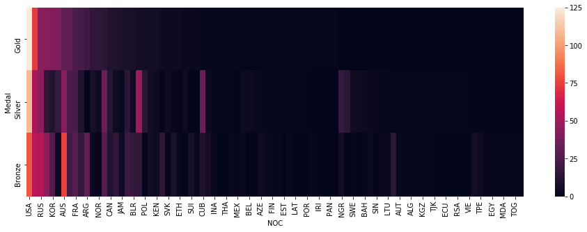


## Creating custom colormaps


```python
from matplotlib.colors import ListedColormap
```


```python
sns.color_palette()
```


    [(0.12156862745098039, 0.4666666666666667, 0.7058823529411765),
     (1.0, 0.4980392156862745, 0.054901960784313725),
     (0.17254901960784313, 0.6274509803921569, 0.17254901960784313),
     (0.8392156862745098, 0.15294117647058825, 0.1568627450980392),
     (0.5803921568627451, 0.403921568627451, 0.7411764705882353),
     (0.5490196078431373, 0.33725490196078434, 0.29411764705882354),
     (0.8901960784313725, 0.4666666666666667, 0.7607843137254902),
     (0.4980392156862745, 0.4980392156862745, 0.4980392156862745),
     (0.7372549019607844, 0.7411764705882353, 0.13333333333333333),
     (0.09019607843137255, 0.7450980392156863, 0.8117647058823529)]


```python
sns.palplot(sns.color_palette())
```


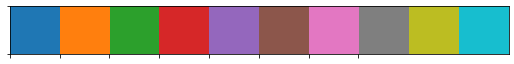


```python
#create a new pallet
gsb=['#FFD700','#C0C0C0','#cd7f32']
```


```python
plt.figure(figsize=(16,5),)
sns.heatmap(data=srt_08.transpose(),cmap=gsb)
```


    <matplotlib.axes._subplots.AxesSubplot at 0x1a922db7ef0>


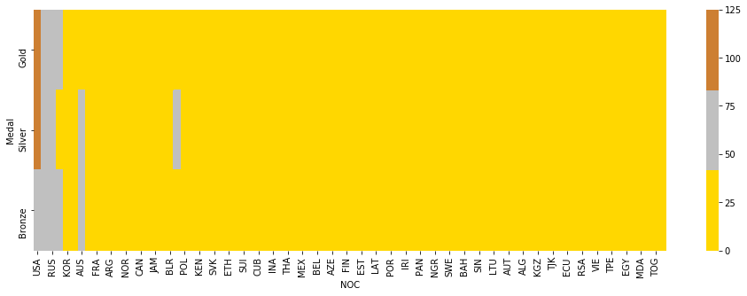

